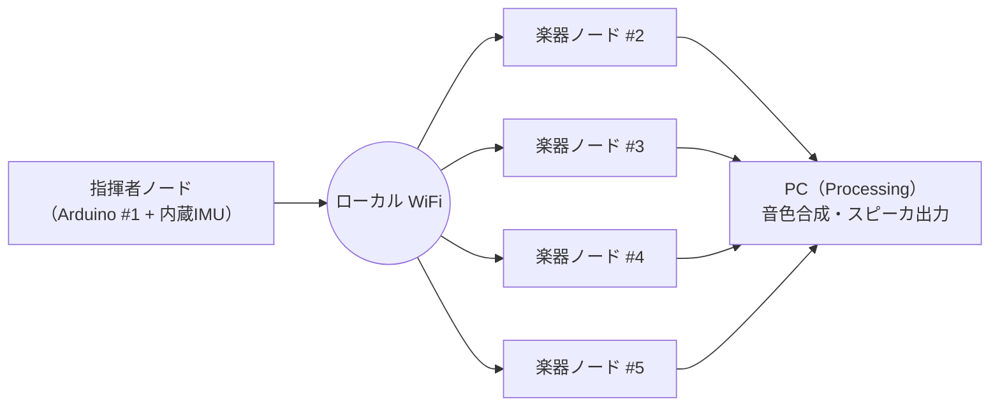

# システム全体アーキテクチャ（概略）

現時点ではブロック図レベルの大枠のみを記述する。
具体的な通信仕様・同期方式・データ形式は、方針が固まったあとで
別ドキュメントや ADR に落とす。

## 全体構成

## 各要素のざっくりした役割

| 要素 | 役割 |
|---|---|
| 指揮者ノード | 指揮者の動きをセンシングし、演奏の制御情報を楽器ノードへ配信する |
| 楽器ノード × 4 | 自分のパートを担当し、発音タイミングと音の情報を PC へ送る |
| PC（Processing） | 受け取った音の情報から音色を合成しスピーカで鳴らす |

## ファームウェア設計方針

Arduino 側のコードは **Embedded-Module-Architecture**
（<https://github.com/takushio2525/Embedded-Module-Architecture>）に準拠して書く。

- `loop()` は **入力 → ロジック → 出力** の 3 フェーズで構成
- 機能単位で `IModule`（`setup()` / `update()`）を実装
- ノード内の状態は `SystemData` に、ノード固有設定は `ProjectConfig` に集約
- 共通層は `firmware/common/lib/` に置いて全ノードで共有

判断の背景と詳細は [ADR-0005](../decisions/0005-firmware-embedded-module-architecture.md) および
[`../../firmware/README.md`](../../firmware/README.md) を参照。

## まだ決めていないこと

以下は今後のミーティングや実装フェーズで詰める。

- 指揮情報を楽器に届ける具体的な通信形式（パケット構造・送信周期）
- 楽器間の同期をどう取るか（マスタークロック方式・相互補正など）
- 楽譜データをどう保持し、どう解釈するか
- ネットワーク構成（AP・IP 割り当て・起動順など）
- 故障・パケロス時の挙動

## 関連ドキュメント

- [`../overview.md`](../overview.md) — プロジェクト全体像
- [`../decisions/`](../decisions/) — 主要な設計判断の記録（ADR）
