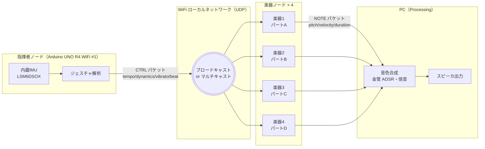

# システム全体アーキテクチャ

## 全体構成

## 各ノードの責務

### 指揮者ノード（Arduino UNO R4 WiFi #1）

- IMU から加速度・角速度を読み取り、指揮ジェスチャを解析
- 指揮コマンド（テンポ・強弱・ビブラート・拍同期）を CTRL パケットとして
  WiFi 経由で楽器ノードへブロードキャスト
- 詳細: [`conductor_gesture.md`](conductor_gesture.md)

### 楽器ノード（Arduino UNO R4 WiFi #2〜#5）

- 自パートの楽譜データをフラッシュ（プログラム）に保持
- CTRL パケットを受信し、テンポ・強弱・ビブラートを反映した
  音符（NOTE パケット）を Processing へ送出
- 各ノードは異なるパートを担当（パートA／B／C／D）

### PC（Processing）

- 各楽器ノードから NOTE パケットを受信
- 金管楽器の音色を合成（倍音構造・ADSR エンベロープ・必要に応じてエフェクト）
- 合成結果をスピーカへリアルタイム再生

## データフロー

| 段階 | 流れ |
|---|---|
| **入力** | 指揮者の身振り → IMU |
| **解析** | IMU 値 → ジェスチャ特徴量（速度・振幅・振動） |
| **配信** | 指揮コマンド → CTRL パケット → 全楽器 |
| **演奏** | 楽器ノードが楽譜＋指揮コマンドから NOTE 生成 |
| **発音** | NOTE パケット → Processing 音色合成 → スピーカ |

## 同期方式

- 指揮者ノードが**マスタークロック**（拍頭で BEAT パケット送出）
- 楽器ノードはローカル時刻と BEAT パケットを比較して位相補正
- 詳細: [`protocol.md`](protocol.md) の「同期方式」セクション

## ネットワーク構成

- ローカル WiFi（教室の既存 AP または持ち込み AP）
- 全ノードは同一サブネット
- IP アドレス：固定割り当て（DHCP に頼らない方が起動順依存が消える）

## 故障時のフォールバック

| 故障 | 挙動 |
|---|---|
| 指揮者→楽器 のパケロス | 楽器側は最後の CTRL パケットの状態を維持して演奏継続 |
| 指揮者ノードダウン | 楽器側はデフォルトテンポで楽譜を最後まで演奏 |
| 楽器ノードダウン | 該当パートが欠落するが他パートは継続 |
| Processing ダウン | 演奏停止（再起動で復帰） |

## 拡張余地

- LED ドライバ（楽器ノードに WS2812B 等）で視覚的同期
- 楽器ノードを増やしてパート追加（プロトコルは台数非依存に設計）
- 課題曲を切り替える「曲選択」コマンドの追加
