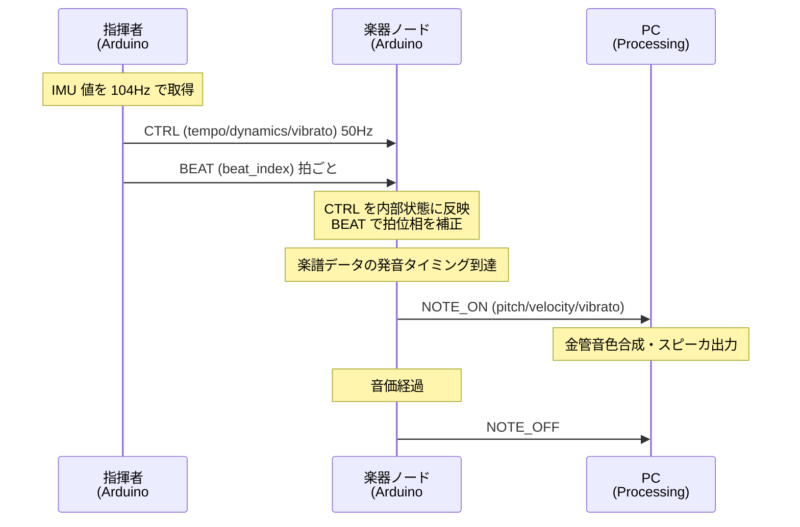

# データフロー（補足図）

システム全体のデータフロー詳細。全体構成は
[`architecture.md`](architecture.md) を、通信仕様は [`protocol.md`](protocol.md) を参照。

## メッセージ単位のフロー

## 主要なデータ構造

| 構造 | 内容 | 定義場所 |
|---|---|---|
| `CTRL` パケット | テンポ・強弱・ビブラート連続値 | [`protocol.md`](protocol.md) |
| `BEAT` パケット | 拍頭タイミング通知 | [`protocol.md`](protocol.md) |
| `NOTE_ON/OFF` パケット | 発音指示 | [`protocol.md`](protocol.md) |
| `Score` 構造体 | 楽譜データ（パートごと） | [`score_format.md`](score_format.md) |
| ジェスチャ特徴量 | 指揮者内部の中間表現（テンポ・振幅等） | [`conductor_gesture.md`](conductor_gesture.md) |

## フェーズ・処理段階

1. **入力フェーズ**: 指揮者の身振り → IMU 生値（加速度・角速度）
2. **解析フェーズ（指揮者）**: IMU 値 → ジェスチャ特徴量 → CTRL/BEAT
3. **配信フェーズ**: CTRL/BEAT を UDP ブロードキャストで楽器へ
4. **演奏フェーズ（楽器）**: 楽譜＋指揮コマンドから NOTE 生成 → PC へ送信
5. **発音フェーズ（PC）**: NOTE → 金管音色合成 → スピーカ出力

## 関連ドキュメント

- 通信仕様: [`protocol.md`](protocol.md)
- アーキテクチャ: [`architecture.md`](architecture.md)
- 指揮ジェスチャ: [`conductor_gesture.md`](conductor_gesture.md)
- 楽譜形式: [`score_format.md`](score_format.md)
