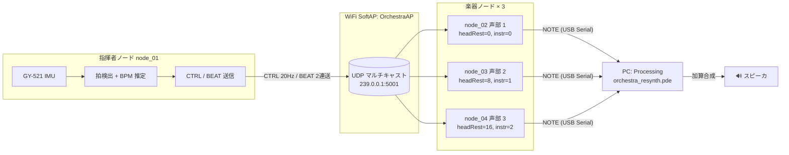

:::note[この章で分かること]
- システム全体がどう繋がっているか
- どのパケットがどの向きに流れるか
- 各ノードに何を任せているか
:::

:::tip[読了目安]
**約 5 分**。前提: [プロジェクト概要](/intro/overview/) を読んでいること。
:::

## ブロック図

## 各要素の責務

### 指揮者ノード（`firmware/test_v2/node_01/`）

- ハードウェア: **XIAO ESP32-S3 Sense + GY-521（MPU6050）**
- やること:
  1. IMU から加速度を読む（5 ms 周期）
  2. ローパスフィルタで重力成分を抜く
  3. 動加速度ノルムが閾値 1.20 g を超えたら **Armed** 状態に
  4. Armed 中の経路長（積分）が 0.20 m に達したら **拍発火**
  5. 拍間隔から BPM を EMA で推定
  6. `CTRL`（20 Hz）と `BEAT`（拍ごと、2 連送）を UDP で配信
- 状態機械: `Idle → Calibrating（2 秒）→ Conducting → Fallback`

詳しいアルゴリズム: [同期戦略](/architecture/sync/)

### 楽器ノード（`firmware/test_v2/node_02〜04/`）

- ハードウェア: **Arduino UNO R4 WiFi**
- やること:
  1. UDP で `CTRL` と `BEAT` を受信
  2. 受信時刻と `timestampMs` から指揮者時計のオフセットを EMA で推定
  3. `BEAT` の `playAtMasterMs` から自時計の発音目標時刻を計算
  4. `beatNo` から自パートの楽譜位置を求める（輪唱の頭ずらしも適用）
  5. 該当する `ScoreEvent` から MIDI ノートを取り出す
  6. 発音時刻に **NOTE** を USB Serial で PC に送る
- 個性: `ProjectConfig.h` の `OrcReceiverConfig{ partId, headRestBeats, ... }` と
  `NoteSenderConfig{ partId, instrumentId, ... }` の構造体リテラル引数だけが
  ノード間で異なる（他は同一コード）

### PC アプリ（`pc_app/test_v2/orchestra_resynth/orchestra_resynth.pde`）

- フレームワーク: **Processing 4**
- やること:
  1. 指定したシリアルポートから NOTE バイナリを受信
  2. NOTE の `instrumentId` で `pc_app/test_v2/orchestra_resynth/data/` 配下の音色 JSON を index 参照（ファイル名昇順）
  3. 倍音 JSON から加算合成（基音 × 各倍音 × 振幅）
  4. ADSR エンベロープで自然な発音
  5. 複数音同時発音（声部 3 並列）

> ⚠️ Processing は USB Serial で **1 つの楽器ノードしか受け取らない** 構成。
> 3 声部の音を 1 台の PC で鳴らすため、各楽器ノードが**全パートの NOTE を統合して**
> 送る運用ではなく、PC 側を複数立ち上げる or マルチポート受信する将来検討事項がある。
> 現状は「1 台の楽器ノードから受け取った 1 声部 + その楽器が認識している他声部のミックス」
> といった対応で、実装の詳細は [pc_app の歩き方](/code/pc-app/) を参照。

## データの流れ（タイミング）

| 時点 | イベント | 関連 |
|---|---|---|
| t=0 | 全ノード起動、指揮者が SoftAP 立ち上げ | — |
| t=2s | 指揮者キャリブレーション完了、`Conducting` 状態に | — |
| t=2s〜 | CTRL を 50 ms ごとに UDP マルチキャスト | 20 Hz |
| t_beat | 指揮者が拍を検出、BEAT を 2 連送 | `playAtMasterMs = t_beat + 50ms` |
| t_beat+50ms | 楽器が自時計で発音目標時刻に到達、NOTE 送信 | USB Serial |
| t_beat+50ms+ε | PC が NOTE を受信して発音 | ADSR 開始 |

ネットワーク遅延 ε は実測で 1〜3 ms 程度。
`beatLookaheadMs=50 ms` の先読みでこれを完全に吸収している。

## 同期の階層

1. **物理層**: 同じ WiFi セル（チャネル 6）にいる全ノード
2. **時刻層**: 指揮者の `millis()` をマスタとして、楽器側がオフセットを EMA 推定
3. **拍層**: 指揮者から `beatNo` で拍番号を共有
4. **楽譜層**: 楽器側が `beatNo` をキーに自パートの音符を引く（輪唱の頭ずらし込み）

## なぜ指揮者ノードに XIAO を使うのか

[ADR-0003](/decisions/0003-conductor-imu/) では Arduino UNO R4 WiFi の内蔵 IMU を
想定していたが、実機検証で次が判明：

- 内蔵 IMU の感度・サンプリングが本用途に不足
- UNO R4 では割り込みベースの IMU 読み取りが書きにくい

そこで **XIAO ESP32-S3 Sense + 外付け MPU6050（GY-521）** に切り替え。
楽器ノードは UNO R4 WiFi のままで構成上の不整合はない（指揮者 → 楽器の通信は UDP）。

## 次に読むべきページ

- 設計パターン → [Embedded-Module-Architecture](/architecture/ema/)
- パケット仕様 → [通信プロトコル](/architecture/protocol/)
- 拍検出の中身 → [同期戦略](/architecture/sync/)
- バージョン構成 → [三段階開発](/architecture/three-stages/)

### さらに深掘りしたい

- ロジックと数式を順番に潜っていく学習導線 → [アルゴリズム詳説 — 読み順ガイド](/deep-dive/)
