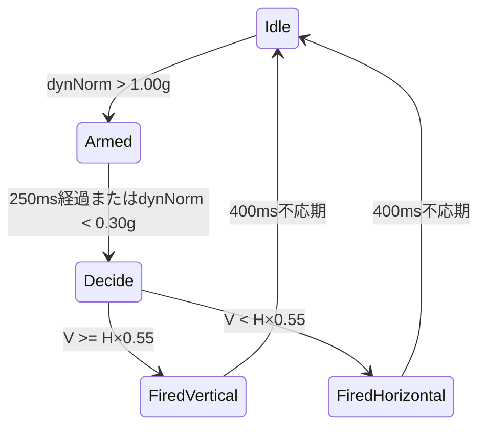

## 実体

`firmware/production/node_01/src/applyPattern.cpp`と`ProjectConfig.h`のproduction固有ロジックです。
PC側は同じ定数を`pc_app/common/OrcProtocol.pde`に持ち、ガイド表示とクリック音を再現します。

## センサー軸を直接使わない理由

指揮棒への取り付け角度が変わると、センサーX/Y/Zと人間の縦横が一致しません。
そこで重力を「地面に対する縦」として、その方向への成分と水平面成分を計算します。

## 重力推定

IMUのLPF済み加速度を`a`、推定重力を`g`とします。

```text
g[n] = g[n-1] + 0.01 × (a[n] - g[n-1])
```

振り中に動加速度が重力推定へ混ざらないよう、`dynNorm >= 0.30 g`では更新を凍結します。

振り加速度：

```text
s = a - g
```

重力単位ベクトル：

```text
u = g / |g|
```

## 縦成分と水平成分

```text
vertical = |dot(s, u)|
horizontalVector = s - dot(s, u) × u
horizontal = |horizontalVector|
```

瞬間値は振り始めに不安定なので、250 ms窓で時間積算します。

```text
V = sum(vertical × dt)
H = sum(horizontal × dt)
```

判定：

```text
V >= H × 0.55  → 縦振り
V <  H × 0.55  → 横振り
```

比0.55は縦を厳密な優勢だけに限定せず、斜めの決定動作も受け入れる実機調整値です。

## ナビ状態機械



横方向の符号は水平ベクトルの支配軸と`NAV_LR_SIGN`から求めます。左右が逆ならConfigで符号だけ反転できます。

## 状態遷移デッドタイム

Menu→Conductingの決定振りが1拍目になる、Resultへ入った最後の振り戻しが即Menu操作になる、という誤認を防ぐため、
すべての状態遷移後600 msはナビと拍を受け付けません。

## ゲームの時間軸

目標は100 BPMです。

```text
targetInterval = 60000 / 100 = 600 ms
GAME_LENGTH_BEATS = 56
```

56拍は4声輪唱の全サイクルと一致します。最終声部が32拍を終えた時点で採点も終了します。

## ガイド強度

経過拍`b`に対するガイド`G(b)`：

```text
b < 16:
  G = 1

16 <= b < 32:
  G = 1 - (b - 16) / 16

b >= 32:
  G = 0
```

| 拍 | 強度 |
|---:|---:|
| 0 | 1.00 |
| 16 | 1.00 |
| 20 | 0.75 |
| 24 | 0.50 |
| 28 | 0.25 |
| 32 | 0.00 |

指揮者LEDとPCクリック音はこの強度を共有します。

## 拍間隔誤差

実際の連続拍間隔を`I_b`、目標600 msを`T`とします。

```text
error_b = abs(I_b - T)
weight_b = 1 - G(b)
```

ガイドが100%の区間は重み0、ガイドが消えるほど重み1へ近づきます。
1拍目は前の間隔がないので採点しません。

## 加重平均

```text
weightedError = sum(weight_b × error_b)
weightTotal   = sum(weight_b)
averageError  = weightedError / weightTotal
```

ガイドがある前半を練習、消えた後半を本採点に近い扱いにします。

## 0〜100点への写像

許容誤差は目標間隔の50%：

```text
tolerance = 600 × 0.5 = 300 ms
rawScore = 100 × (1 - averageError / tolerance)
score = clamp(round(rawScore), 0, 100)
```

例：

| 平均誤差 | 得点 |
|---:|---:|
| 0 ms | 100 |
| 30 ms | 90 |
| 75 ms | 75 |
| 150 ms | 50 |
| 300 ms以上 | 0 |

これはテンポの平均値だけでなく、拍ごとの維持精度を測ります。

## CTRLとUI

ゲーム中もCTRLの`bpmQ8`は実振りBPMです。

- `mode=1`
- `targetBpm=100`
- `score=0xFF`：採点中
- Resultで`score=0〜100`

node_02がUIへ中継し、PCは画面と得点を表示します。PC自身は採点せず、指揮者の結果を表示します。

## PCメトロノーム

PCはUI受信時刻をゲーム開始基準にし、目標BPMからローカルでクリック時刻を生成します。
ガイド強度を音量へ掛け、32拍以降は生成しません。採点の真値は指揮者であり、PCクリックの描画遅延は得点に入りません。

## 境界条件

- `weightTotal=0`なら100点初期値を維持
- BPM異常・targetBpm=0では採点しない
- 56拍到達で得点を1回だけ確定
- Result中は得点を凍結
- Menuへ戻ると累積値と`score=0xFF`をリセット
- 演奏中に30秒間拍がない場合はMenuへ戻り、次回の演奏を曲頭から始める

## 調整時の注意

- `GAME_LENGTH_BEATS`と`CANON_CYCLE_BEATS`を同時に変更する
- PC側の16/32/56も同時更新する
- 許容比を変更すると得点分布が大きく変わるため実測ログで再評価する
- ナビ閾値と拍閾値は別であり、片方の調整をもう片方へコピーしない

関連：[ゲームモード](/system/game-mode/) / [指揮者main](/firmware/main-conductor/)
