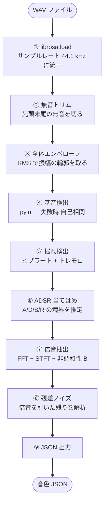
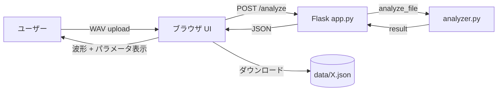

:::note[この章で分かること]
- なぜ「音声解析」というステップが必要なのか
- 実楽器の WAV から音色 JSON ができるまでの **9 段のパイプライン**
- 各段で **どんな数学** を使って何を取り出しているか
- 「基音」「倍音」「ADSR」「非調和性」など、PC アプリ側の用語が **どこから来ているか**
:::

:::tip[読了目安]
**約 15 分**。前提知識: [③Processing のあらまし](/essentials/processing/) を読んでいること。
信号処理の経験は不要。FFT という言葉は出てくるが「周波数ごとに山の高さを取る道具」程度の理解で OK。
:::

:::caution[このページの位置づけ]
このページは **塩澤が一例として組んだ Python 解析** をやさしく解剖する入門編。
他のメンバーが別言語で書き直したり、別の手法を選んだりするときの参考にしてほしい。
詳しい数式・実装は詳説 [analyzer-overview / harmonics / modulation](/pc-audio/analyzer-overview/) に進む。
:::

## なぜ「解析」が必要なのか

PC アプリ側は **加算合成** で音を作っている（[③のあらまし](/essentials/processing/) 参照）。
そのために必要なパラメータ — **倍音の比率、ADSR、ビブラート速度、非調和性係数など** — は
本来「楽器ごとに違う、決め打ちできない値」。

選択肢は 2 つ。

| やり方 | 長所 | 短所 |
|---|---|---|
| 手で JSON を書く | 何もいらない | 楽器らしくならない、調整が地獄 |
| **実楽器を録音して解析する** | 値が現実から来る | 解析ツールが必要 |

このプロジェクトは後者を選んだ。実音を **数学的に分解** して、JSON に書き戻す。
それをやるのが `sound_lab/analyzer/` 配下のツール。


> 解析と Processing は **JSON 1 ファイルで疎結合**。
> 解析側を C++ や Rust で書き直しても、JSON 仕様さえ守れば Processing 側はそのまま動く。

## ツールの構成

```
sound_lab/analyzer/
├── analyzer.py            ← 解析コア（670 行、Python + librosa + numpy）
├── app.py                 ← Flask バックエンド（96 行）
└── static/                ← ブラウザ UI（HTML / JS）
```

使い方は次のいずれか。

1. **ブラウザ UI**: `python app.py` で起動して WAV をアップロード、波形を見ながら解析
2. **コマンド**: `analyze_file("path/to/sample.wav")` を Python から直接呼ぶ

入出力は明確。

```python
result = analyze_file(path_to_wav, name=None)
# 戻り値:
#   { "instrument": {...},  # data/<id>.json に書く
#     "preview":    {...} }  # 波形プレビュー用
```

## パイプライン全体図

WAV を受け取ってから JSON を返すまで、9 段の処理を順に通る。



ここから各段を「何をしているか」「何を取り出したいか」の視点で見ていく。

## ① 波形を読み込む

```python
y, sr = librosa.load(path, sr=44100, mono=True)
```

何が起きるか:

- 任意のサンプリングレート（48 kHz、22 kHz など）の WAV を **44.1 kHz に統一**
- ステレオなら **モノラルに集約**
- `y` は `-1.0 〜 +1.0` の浮動小数点配列になる

> 統一しておくと、後段の処理が「サンプリングレートを意識せず」に書ける。

## ② 無音を切る

録音には頭と尻に必ず無音区間がある。それを残したまま解析すると ADSR の attack が
ぐちゃぐちゃになる。

```python
y = _trim_silence(y)
# 先頭: −20 dB 以下を無音判定してカット
# 末尾: −50 dB 以下を無音判定してカット
```

- 先頭は「演奏が始まった瞬間」を `attack` の起点にしたいので緩めに
- 末尾は「リリースが完全に消えるまで」を残したいので厳しく

## ③ 振幅の輪郭を取る（全体エンベロープ）

「音が時間とともにどう大きくなったり小さくなったりするか」を 1 本の曲線で取り出す。

```python
env = librosa.feature.rms(y, frame_length=2048, hop_length=220)
# env_hz = 44100 / 220 ≒ 200 Hz でサンプリング
```

RMS（Root Mean Square）は **「短い窓内のエネルギー」** を返す関数。
ATTACK / DECAY / SUSTAIN / RELEASE の境界はこの `env` を見て決める。

```
y(t)        ▲▲▲▼▲▼▲▼▲▼▲▼▼▲▼▲▼▲▼▲▼▲▼▼▼▲▼▲▼▲     (生波形)
              ↓ RMS で「振幅の輪郭」だけ取る
env(t)      ╱── 大きく ────────────╲             (200 Hz でサンプル)
```

## ④ 基音（ピッチ）を検出する

「この音は何 Hz の高さか」を求める。これがないと倍音抽出ができない。

```python
fundamental_hz, f0_track = _detect_fundamental(y)
# まず librosa.pyin（精度高い）を試す
# 失敗したら 自己相関 にフォールバック
```

| 手法 | 仕組み | 精度 | 速さ |
|---|---|---|---|
| **pyin** | HMM ベース、F0 候補に確率を割り振る | 高い | 遅め |
| **自己相関** | 波形を時間シフトして「自分と一致する周期」を探す | 並 | 速い |

> 楽器によっては pyin が失敗する（極端な打楽器、ノイズ的な音）。
> その時に自己相関にフォールバックすることで「とにかく何かしらの基音を返す」設計にしている。

戻り値の `f0_track` は **時間ごとの基音周波数**（音程が揺れている場合は変動する）。

## ⑤ 揺れを検出する

`f0_track` が周期的にゆらいでいれば **ビブラート**、`env` が周期的にゆらいでいれば
**トレモロ**。

```python
modulation = _detect_modulation(f0_track, env, env_hz=200)
# 戻り値:
#   vibrato: { rate (Hz), depthCent }
#   tremolo: { rate (Hz), depth }
```

検出アルゴリズム:

1. `f0_track` から平均ピッチを引いた **残差** を取る
2. 残差の **FFT** を取って、最も強い周波数成分を探す
3. その周波数が 1〜20 Hz の範囲なら「揺れ」と判定
4. ピーク振幅から **深さ**（cent 単位 or 振幅比）を測る

> ビブラートが「ある」と判定された場合だけ JSON に書き込む。
> 機械的な定常音には書かない（False positive を避ける）。

## ⑥ ADSR を当てはめる

`env` の輪郭を見て、**A / D / S / R の境界時刻** を推定する。

```python
adsr = _fit_adsr(env, env_hz=200)
# 戻り値: { attack, decay, sustain_level, release, loop_start, loop_end }
```

アルゴリズム概略:

```
env の最大値を見つけ、その時刻を Attack end とする
         ↓
最大値の 0.7〜0.9 倍に落ち着く時刻を Decay end (= Sustain start) とする
         ↓
末尾から −50 dB を割る時刻を Release end とする
         ↓
Sustain 区間の中央 50% を loop_start / loop_end とする
```

> 「loop_start / loop_end」は加算合成側で「持続音の安定区間」として参照される。
> 弦楽器でこの区間にだけビブラートを乗せる、という使い方ができる。

## ⑦ 倍音を抽出する

ここが解析の主役。**定常区間の長尺 FFT** で倍音の山を探し、各倍音について **時間方向の
強さの変化** を STFT で取る。

```python
harmonics, inharmonicity_b = _analyze_harmonics(y, steady, fundamental_hz, n_env)
```

手順:

1. Sustain 区間から **長い窓**（4096 サンプル）で FFT を計算
2. `f0, 2f0, 3f0, ...` の理論位置の近くで **ピーク** を探す
3. 各ピークの **振幅** を倍音の `amp` として記録
4. 実測した倍音位置と理論位置のずれから **非調和性係数 B** をフィット
5. STFT で各倍音の **時間エンベロープ** を取る（倍音ごとに ADSR が違う）

```
振幅
│
│  ●                                    ← 基音 (実測周波数 442 Hz)
│     ●                                 ← 2 倍音 (884 Hz, 理論より +0 Hz)
│        ●                              ← 3 倍音 (1326 Hz, 理論より +1 Hz)
│           ●                           ← 4 倍音 (1770 Hz, 理論より +3 Hz)  ← 非調和性で外側にずれる
│              ●
│                    ●
└─────────────────────────────► 周波数

非調和性係数 B を、観測ずれから最小二乗フィット:
    f_n = n × f0 × √(1 + B × n²)
```

> このプロジェクトの「弦らしさ」「ピアノらしさ」の正体は、ほとんどこの **B** と
> **倍音ごとの ADSR** の組み合わせで決まる。

## ⑧ 残差ノイズを取る

倍音だけでは「サー」とか「フッ」というノイズ成分が再現できない。
**倍音を全部引いた残り** がノイズ。

```python
noise = _analyze_noise(y, fundamental_hz, harmonics, n_env)
```

手順:

1. STFT で各倍音の **マスク領域** を作る（理論周波数 ± 数ビン）
2. 元の STFT から **マスク領域だけ削除** して inverse STFT
3. 残った波形のレベル・周波数特性（低域 / 中域 / 高域）を測る

```
スペクトル ─── 倍音マスクで削る ───► 残差ノイズ
                                        │
                                        ↓
                                  帯域別レベル測定
                                  (low / mid / high)
                                        │
                                        ↓
                                  ノイズ色 (white / pink / blue)
```

> 木管楽器の「息」、弦楽器の「擦り」、金管の「リップ」など、倍音だけでは作れない
> 楽器固有の質感がここに乗る。

## ⑨ JSON に書き出す

最後に、ここまでで取り出した全パラメータを 1 つの辞書にまとめて、JSON に書く。

```json
{
  "name": "violin_A4",
  "fundamentalHz": 442.1,
  "inharmonicity_b": 0.0008,
  "adsr": { "attack": 0.08, "decay": 0.12, "sustain_level": 0.72, "release": 0.30 },
  "loop": { "start": 0.45, "end": 1.25 },
  "harmonics": [
    { "n": 1, "ratio": 1.00, "amp": 1.00, "env": [...] },
    { "n": 2, "ratio": 2.00, "amp": 0.62, "env": [...] },
    { "n": 3, "ratio": 3.00, "amp": 0.31, "env": [...] },
    ...
  ],
  "vibrato": { "rate": 5.4, "depthCent": 14.2 },
  "tremolo": { "rate": 3.8, "depth": 0.06 },
  "noise": { "level": 0.04, "bands": { "low": 0.3, "mid": 0.5, "high": 0.2 } }
}
```

これを `pc_app/test_v2/orchestra_resynth/data/<id>.json` に置けば、PC アプリ側で
即座にその音色で鳴らせるようになる。

## なぜ Python（librosa）を選んだか

| 必要な処理 | 既製ツール |
|---|---|
| WAV ロード（任意 sr → 統一） | `librosa.load` |
| 基音検出（pyin） | `librosa.pyin` |
| STFT / FFT | `librosa.stft` / `numpy.fft` |
| RMS / スペクトル特徴量 | `librosa.feature.*` |

これを C++ や Java で 1 から書くと **半年仕事**。オフライン処理に **リアルタイム制約は無い**
ので、**最も書きやすい言語** を選ぶのが妥当。

> 「Processing 側と言語が違う」のは欠点ではなく、**疎結合の表れ**。
> JSON 仕様だけ合わせれば、解析側の言語は何でもいい。

## ブラウザ UI でできること

`python app.py` で Flask サーバを起動すると、ブラウザから次のことができる。

- WAV をドラッグアンドドロップでアップロード
- 解析結果（基音・倍音・ADSR・ノイズ）を **波形と一緒に表示**
- 各倍音のエンベロープを個別にプレビュー
- 気に入った結果を JSON ダウンロード → Processing の `data/` に置く



## 別方針で書き直したい人へ

| やりたいこと | 差し替える部分 |
|---|---|
| Python ではなく C++ / Rust で | パイプライン全体。JSON 仕様だけ守る |
| pyin の代わりに別の基音検出 | `_detect_fundamental` のみ |
| FFT の代わりに wavelet | `_analyze_harmonics` のみ |
| ADSR ではなく BFGS フィット | `_fit_adsr` のみ |
| 非調和性 B を使わず単純整数倍 | `_analyze_harmonics` の B フィット部を省略 |

各段が独立しているので、興味のある段だけ書き換えても全体は動く。

## 解析を省略してとにかく音色 JSON を作りたい人へ

最終手段として、**手書きで JSON を書く** こともできる。最低限必要なのは:

```json
{
  "name": "適当な楽器",
  "fundamentalHz": 440.0,
  "harmonics": [
    { "n": 1, "ratio": 1.0, "amp": 1.0 },
    { "n": 2, "ratio": 2.0, "amp": 0.5 },
    { "n": 3, "ratio": 3.0, "amp": 0.3 }
  ],
  "adsr": { "attack": 0.02, "decay": 0.1, "sustain_level": 0.7, "release": 0.2 }
}
```

これだけでも音は鳴る。「らしさ」は出ないが、デバッグ用や仮の音色としては十分。

## 次に読むべきページ

| 知りたいこと | 行き先 |
|---|---|
| パイプラインの数式と実コード | [analyzer-overview](/pc-audio/analyzer-overview/) |
| 倍音抽出と非調和性の詳細 | [analyzer-harmonics](/pc-audio/analyzer-harmonics/) |
| 基音検出と ADSR の詳細 | [analyzer-modulation](/pc-audio/analyzer-modulation/) |
| 出力 JSON の正式仕様 | [pc-audio/instr-model](/pc-audio/instr-model/) |
| 解析を別言語で書き直す | [pc-audio/extending](/pc-audio/extending/) |
| 1 つ前のあらまし | [③Processing のあらまし](/essentials/processing/) |
| 最初のあらまし | [①プロジェクト全体のあらまし](/essentials/project/) |
