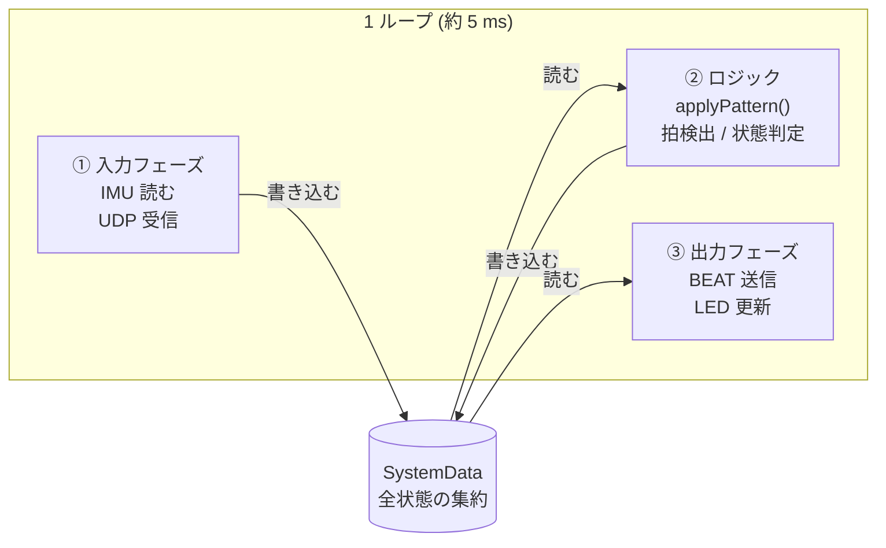
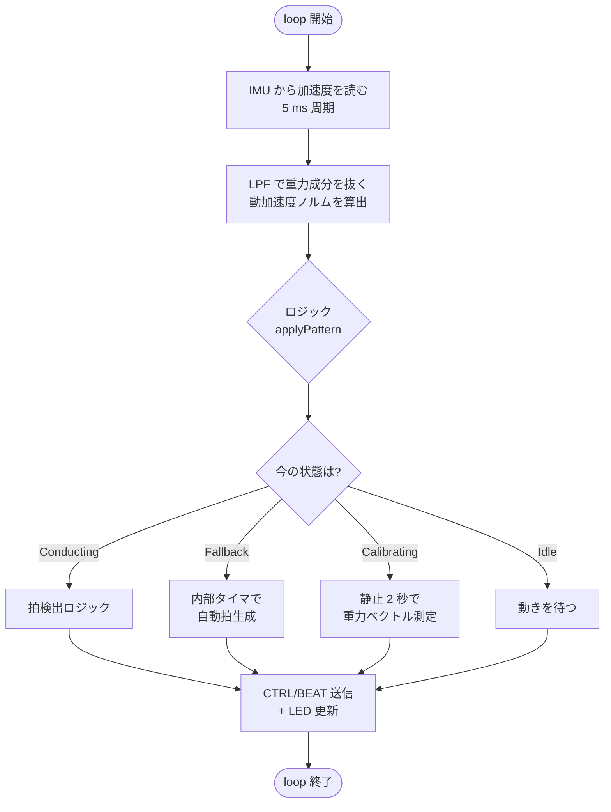
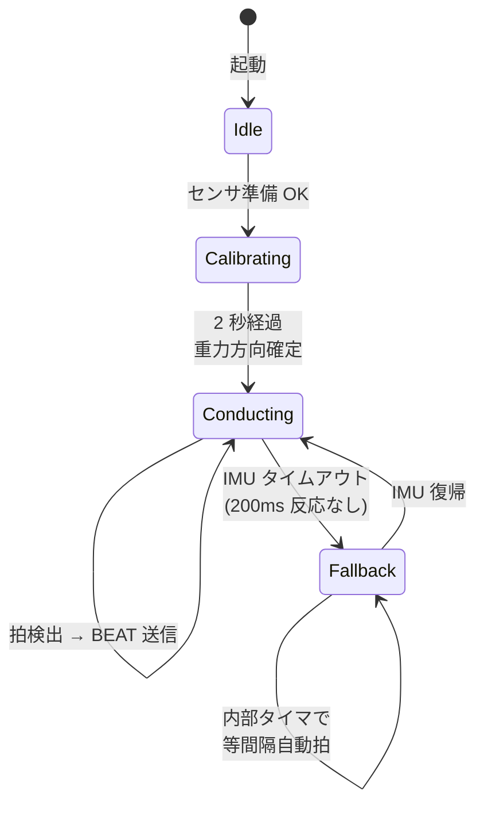
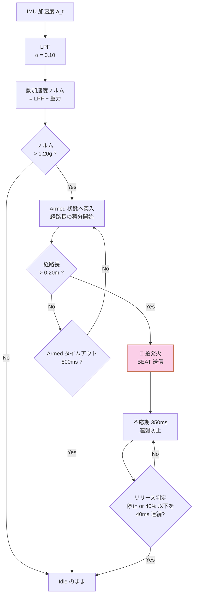
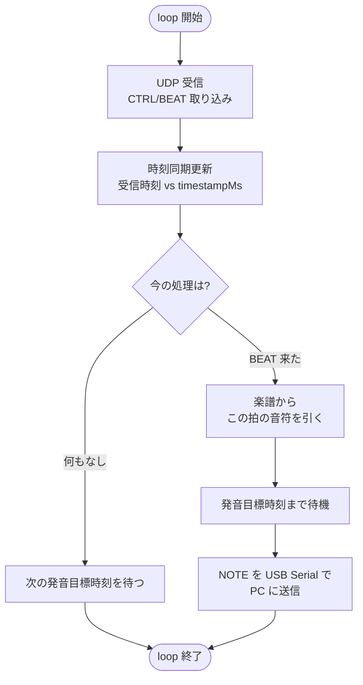
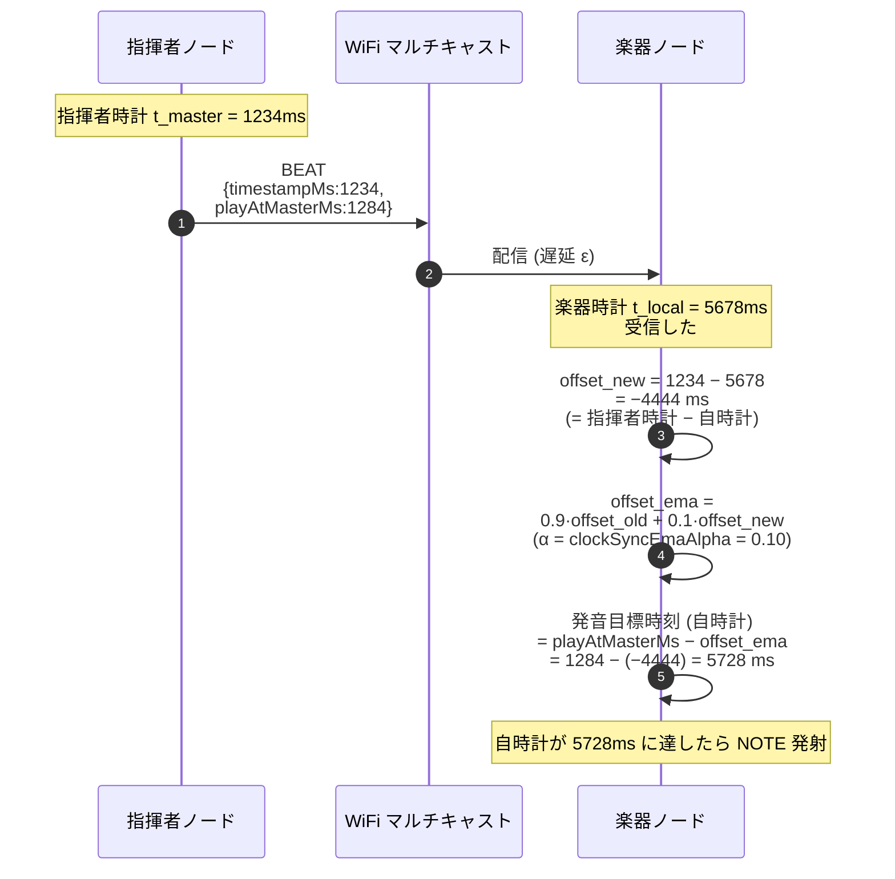

:::note[この章で分かること]
- マイコン側のコードがどんな考え方で組まれているか（**EMA** という設計パターン）
- 指揮者ノードと楽器ノードが **それぞれ何をしているか** をざっくり
- 拍検出 / 時刻同期 / 楽譜進行 の **理屈の核** だけ
:::

:::tip[読了目安]
**約 15 分**。前提知識: [①プロジェクト全体のあらまし](/essentials/project/) を読んでいること。
C++ や Arduino を書いたことがなくても読めるように、コードは概念図と擬似コード寄りにしてある。
:::

:::caution[このページの位置づけ]
ここでは **「ファームの中で何が起きているか」を絵で掴む** ことを優先する。
実装コード・閾値・状態遷移の細部は、章末からリンクで詳説に進める。
:::

## ファームの構成

マイコン側のコードは `firmware/test_v2/` 配下にあって、ノードごとにフォルダが分かれている。

```
firmware/test_v2/
├── common/lib/          ← 全ノードで共有するライブラリ
│   ├── ModuleCore/      ←   モジュールの抽象基底
│   ├── OrcProtocol/     ←   通信パケットの形
│   ├── OrcNetModule/    ←   WiFi + UDP の世話役
│   ├── StatusLedModule/ ←   状態表示 LED
│   └── SerialDebug/     ←   デバッグ出力切替
│
├── node_01/             ← 指揮者ノード (XIAO ESP32-S3 Sense)
│   ├── include/         ←   SystemData / ProjectConfig
│   ├── src/             ←   main.cpp / applyPattern.cpp
│   └── platformio.ini
│
├── node_02/             ← 楽器ノード (Arduino UNO R4 WiFi, 声部1)
├── node_03/             ← 楽器ノード (声部2)
└── node_04/             ← 楽器ノード (声部3)
```

ポイント:

- **共通部分は `common/lib/`** に切り出されていて、各ノードの `platformio.ini` から参照する
- **ノード固有部分** は `node_XX/` に閉じ込めて、設定値は `include/ProjectConfig.h` に集約
- 楽器ノード 3 台（02/03/04）は **ほぼ同じコード**。違いは `ProjectConfig.h` の数値だけ

> 「楽譜を変えるには 3 台同時に書き換える」のは、輪唱で全パートが **同一の楽譜配列** を持つから。
> 各ノードは自分の `headRestBeats` 拍だけずらして読むことで、自然と輪唱になる。

## 設計の根っこ — Embedded-Module-Architecture（EMA）

「いきなり `main.cpp` を読んでも、どこから手をつけていいか分からない」という事故を避けるために、
このプロジェクトは **EMA** という設計パターンを全面採用している。

### EMA を一言でいうと

**「マイコンの中の処理を、入力 → ロジック → 出力 の 3 段階に分けて、それぞれ独立したモジュールで書く」** 設計。

- 入力モジュール（センサ、通信受信）は **読むだけ**
- ロジック（`applyPattern()`）は **判断するだけ**
- 出力モジュール（LED、通信送信）は **書くだけ**

そして 3 者は **`SystemData` という共有メモリ** だけを通してやり取りする。
モジュール同士が直接呼び合うことはない。

### 3 フェーズループの絵



擬似コード:

```cpp
void loop() {
    // ① 入力: 外界からデータを取り込む
    for (auto* m : gInputs)  m->updateInput(gData);

    // ② ロジック: SystemData を見て判断する
    applyPattern(gData);

    // ③ 出力: SystemData を外界に反映する
    for (auto* m : gOutputs) m->updateOutput(gData);
}
```

### なぜこの分け方をするか

- **読みやすい**: ある状態が「なぜそうなったか」を `applyPattern()` の中だけ見れば追える
- **テストしやすい**: モジュール 1 つを差し替えても他に波及しない（センサを別のものに変えても OK）
- **デバッグしやすい**: `SystemData` を 1 枚スナップショット取れば、その瞬間の全状態が分かる

> モジュール同士の直接呼び出しを禁じているのは、**「あちこちで状態が変わって追えなくなる」** という
> 組み込み開発の典型的な事故を防ぐため。これを「グローバル変数の地獄」と呼ぶ人もいる。

### SystemData は何を持っているか

指揮者ノードの `SystemData` を覗くと、こうなっている。

| フィールド | 何が入っているか | 書き手 | 読み手 |
|---|---|---|---|
| `imu` | 加速度・ジャイロ生値、LPF 後の値、動加速度ノルム | ImuModule（入力） | applyPattern |
| `orcNet` | WiFi 接続状態、UDP 受信バッファ | OrcNetModule | applyPattern |
| `beat` | 拍検出結果（拍が今発火したか、何拍目か、`playAtMasterMs`） | applyPattern | OrcSenderModule（出力） |
| `tempo` | 推定 BPM、次拍予測時刻 | applyPattern | OrcSenderModule |
| `conductor` | 状態機械（Idle / Calibrating / Conducting / Fallback） | applyPattern | StatusLedModule |
| `sender` | CTRL/BEAT の送信統計（seq 番号、最終送信時刻） | OrcSenderModule | applyPattern |

楽器ノードの `SystemData` は別物で、主に `ReceiverLogicData`（CTRL/BEAT 受信ロジック）、
`SyncLogicData`（指揮者時計との offset と EMA 状態）、`CtrlData`（受信中の BPM / state）、
`ScoreProgressData`（楽譜進行位置 + 細分音符予約）、`NoteOutData` / `NoteSenderData`
（直近 NOTE と送信統計）を持つ（実体は `firmware/test_v2/node_02/include/SystemData.h`）。

## 指揮者ノードが何をしているか

指揮者ノードの「1 ループあたりの仕事」を時系列で書くとこうなる。



### 状態機械の核



| 状態 | 何をしているか | 抜ける条件 |
|---|---|---|
| **Idle** | キャリブレーション待ち / 通信待ち | センサ準備 OK → Calibrating |
| **Calibrating** | 起動 2 秒間、静止して重力方向を測る | 2 秒経過 → Conducting |
| **Conducting** | 通常の演奏中。拍を検出して BEAT を送る | IMU タイムアウト → Fallback |
| **Fallback** | IMU が応答しない時の安全網。内部タイマで等間隔の拍を出す | IMU 復帰 → Conducting |

> Fallback は「センサが壊れても演奏が止まらない」ための保険。
> ハッカソン本番で IMU が抜けても、デモが完全停止しないように仕込んである。

### 拍検出を一言でいうと

**「腕の振りが、ある一定の距離（経路長）を超えたら『拍』とみなす」** 仕組み。



| 段階 | やっていること | なぜそうするか |
|---|---|---|
| ローパスフィルタ（LPF） | 加速度の高周波ノイズを削る | センサノイズで誤検知しないように |
| 動加速度ノルム | LPF 後の加速度 − 重力ベクトル | 「静止しているか / 動いているか」を分離 |
| Armed 判定（1.20 g） | 「振り始めた」と認識 | 小さな揺れで拍が出ないよう閾値を設定 |
| 経路長積分（0.20 m） | 振りの距離を積算 | ピーク値より「振り幅」で判断する方が安定 |
| 不応期（350 ms） | 一度発火したら 350 ms 拒否 | ≒ 170 BPM 上限、誤連射対策 |

詳しいアルゴリズムと閾値の根拠: [拍検出アルゴリズム](/deep-dive/beat-detection/)

### 送信のタイミング

| パケット | 送る頻度 | 中身の核 |
|---|---|---|
| **CTRL** | 50 ms ごと（20 Hz） | 推定 BPM、velocity、状態 |
| **BEAT** | 拍発火のたびに **4 連送** | 拍番号 `beatNo`、発音目標時刻 `playAtMasterMs` |

「BEAT を連送する」のは **パケロス対策**。
WiFi マルチキャストは到達保証がないので、同じ内容を複数回送って 1 回でも届けば OK にしている。
楽器側は `beatNo` の重複を見て弾く。連送回数は当初 2 回だったが、ESP32-S3 SoftAP の
radio ロス対策で 2026-05-25 から 4 連送に増量（暫定値）。

## 楽器ノードが何をしているか

楽器ノードのループも 3 フェーズだが、入力側に **UDP 受信**、出力側に **NOTE 送信** が来る。



### 時刻同期を一言でいうと

**「指揮者と自分の時計のズレを、受信のたびに測って覚えておく」** 仕組み。



EMA は「指数移動平均」のこと。古い値を 90 %（= `1 − α`）残しつつ、新しい値を
10 %（= `α = 0.10`）混ぜる平均化方式で、ネットワーク遅延のジッタを吸収しつつ、
長期的なクロックドリフトに追従できる。

実コード `firmware/test_v2/node_02/lib/OrcReceiverModule/OrcReceiverModule.cpp` は
`sample = timestampMs − millis()` を計算する。つまり `offsetMs` は
**「指揮者時計 − 自時計」** で、自時計のほうが進んでいれば負、指揮者時計のほうが
進んでいれば正の値になる。発音目標時刻の換算は **`playAtMasterMs − offsetMs`**
（applyPattern.cpp の `targetLocalMs` の式）。

詳細: [時刻同期メカニズム](/deep-dive/time-sync/)

### 楽譜からの音符の引き方

楽譜は `src/score_data.cpp` に配列で直書きされている（3 ノードとも同一内容）。
楽器ノードは BEAT の `beatNo` を見て、こう計算する。

```cpp
// 擬似コード
// beatNo は 1 オリジン (1, 2, 3, ...) なので -1 で 0 オリジン配列の添字に揃え、
// さらに headRestBeats で自分の頭ずらし分を引く
int myBeat = (int)beatNo - 1 - (int)headRestBeats;
if (myBeat < 0) return;                  // まだ自分の番じゃない
int idx = myBeat % kScoreLength;         // 曲の長さで mod (途中起動対応)
ScoreEvent ev = kScore[idx];             // 配列から音符を取り出す
sendNote(ev.noteNumber, ev.velocity, ev.durationQ8);
```

ポイント:

- **`headRestBeats`** が node_02=0、node_03=8、node_04=16 と違うから、輪唱になる
- **`% kScoreLength`** で曲の長さ周期で巡回するから、PC を途中起動しても OK
- **`durationQ8`** は 1/256 拍単位（256 = 1 拍）。8 分音符は 128

### 輪唱の頭ずらしのイメージ

3 台とも同じ楽譜配列を持っているが、**読み始める位置がずれている** だけで輪唱になる。

```
beatNo:    0   1   2   3   4   5   6   7   8   9  10  11  12 ...
楽譜:     [ド][ド][ソ][ソ][ラ][ラ][ソ][ー][ファ][ファ][ミ][ミ][レ]...
                                              ↑
                                              曲の頭

node_02 (headRest=0):   ↑読み始め → ド ド ソ ソ ラ ラ ソ ー ファファミ ミ レ
                                  beat 0 から 鳴る

node_03 (headRest=8):                                        ↑読み始め → ド ド ソ ソ ...
                                                            beat 8 から 鳴る
                                                            (= node_02 が "ファ" を鳴らした拍)

node_04 (headRest=16):                                                            ↑読み始め
                                                                                beat 16 から 鳴る
```

3 台同じ楽譜 + 8 拍ずつ遅らせて入る = カノン的な「きらきら星」3 声輪唱になる。

詳細: [楽譜進行ロジック](/deep-dive/score-progression/)

## 共通ライブラリ（5 つ）

`firmware/test_v2/common/lib/` に置かれていて、全ノードから `lib_extra_dirs` で参照する。

| ライブラリ | 役割 |
|---|---|
| `ModuleCore/` | `IModule` 抽象基底 + `ModuleTimer` 周期実行ヘルパー |
| `OrcProtocol/` | CTRL/BEAT/NOTE の **20 B 固定パケット** 構造体 |
| `OrcNetModule/` | WiFi（SoftAP / Station）+ UDP マルチキャスト送受信 |
| `StatusLedModule/` | 状態に応じた LED 点滅出力 |
| `SerialDebug/` | `SERIAL_DEBUG` マクロで有効 / 無効を切替えるラッパー |

> 楽器ノードはバイナリ NOTE をシリアルで吐く都合上、`SERIAL_DEBUG=0` がデフォルト。
> テキスト混在を避けないと PC 側のパケットパーザが詰まる。

詳細: [ファームウェア モジュール詳説](/firmware/)

## 設定値はすべて ProjectConfig.h に集める

ピン配置・WiFi 認証情報・拍検出の閾値などは **各ノードの `include/ProjectConfig.h`** に集約。
モジュール本体（`src/*.cpp`）には絶対に書かない、という規約がある。

```cpp
// 指揮者ノードの一部
constexpr uint8_t I2C_SDA_PIN = 5;          // D4
constexpr uint8_t I2C_SCL_PIN = 6;          // D5

inline const OrcSenderConfig ORC_SENDER_CONFIG = {
    /*ctrlIntervalMs=*/  50,                 // CTRL を 20 Hz で送信
    /*beatRedundancy=*/  4,                  // BEAT を 4 連送 (2026-05-25 暫定・旧 2 から増量)
    /*beatLookaheadMs=*/ 50,                 // 発音は 50 ms 先読み
};

namespace logic_params {
    constexpr float    BEAT_DYN_THRESHOLD_G = 1.20f;
    constexpr float    BEAT_FIRE_PATH_M     = 0.20f;
    constexpr uint32_t BEAT_REFRACTORY_MS   = 350;
    // ...
}
```

**閾値を変えたいとき、触るのはこのファイルだけ**。
ロジック本体（`applyPattern.cpp`）には数値リテラルを書かない。

## ハードウェアの落とし穴ベスト 3

実機で踏みやすい罠を最初に共有しておく。

| 落とし穴 | 症状 | 対処 |
|---|---|---|
| **XIAO の LED は active LOW** | `digitalWrite(HIGH)` で消える | `StatusLedConfig.activeLow = true` を確認 |
| **IMU の AD0 配線** | I2C で IMU が見つからない | AD0 を GND に落とす（アドレス 0x68 固定） |
| **UNO R4 WiFi の SoftAP 不調** | 楽器ノードが指揮者に繋がらない | チャネル 6 で `WiFi.beginAP()` 前に少し待機 |

詳細: [よく出るトラブルと対処](/code/troubleshooting/)

## 3 段階開発の現在地

| バージョン | 状態 | 推奨度 |
|---|---|---|
| `firmware/test_v1/` | C major 圏の和音で同期検証（完了） | × 参照のみ |
| `firmware/test_v2/` | 「きらきら星」3 声輪唱 + 楽器番号対応 **← 現行** | ◎ 積極開発 |
| `firmware/production/` | 本番想定の素テンプレ（EMA 未適用） | △ 結合後に取り込む |

「新機能は test_v2 で実装 → 検証後に production に取り込む」運用。

## 次に読むべきページ

| 知りたいこと | 行き先 |
|---|---|
| ファームのコードを実際に開いて読みたい | [firmware の歩き方](/code/firmware/) |
| EMA の細部・なぜこのパターンか | [Embedded-Module-Architecture](/architecture/ema/) |
| 拍検出を式と状態遷移で詰めたい | [拍検出アルゴリズム](/deep-dive/beat-detection/) |
| 通信パケットの 1 バイトずつ | [バイナリパケット](/deep-dive/binary-packet/) |
| 1 モジュール 1 ページで深掘り | [ファームウェア モジュール詳説](/firmware/) |
| 次のあらまし | [③Processing のあらまし](/essentials/processing/) |
