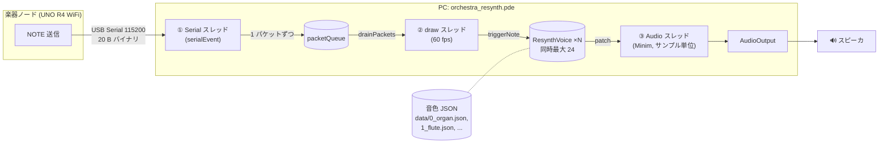
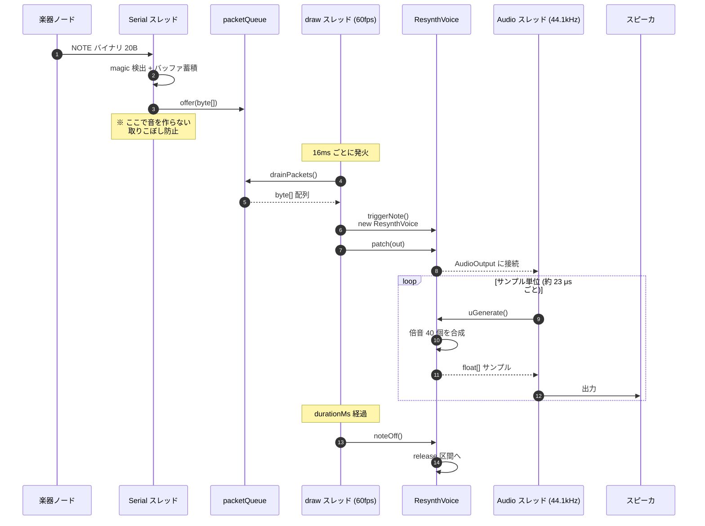
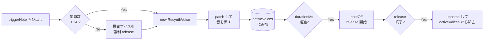
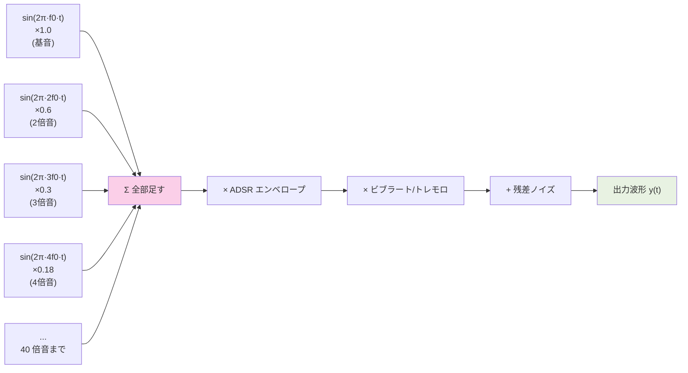
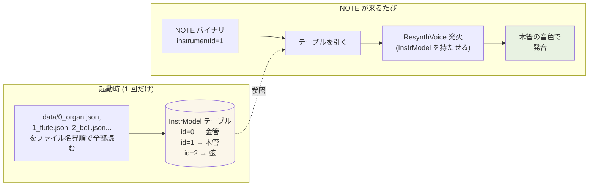
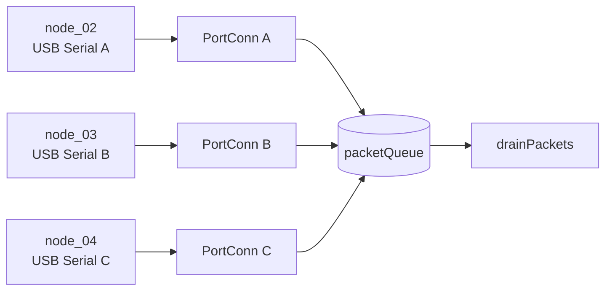

:::note[この章で分かること]
- PC アプリ（Processing スケッチ）が **NOTE を受け取ってから音が出るまで** の流れ
- **加算合成** が何をしているか、倍音 / ADSR / 非調和性の役割
- **ボイス管理** とマルチポート受信の仕組み
- 音色 JSON が PC アプリと音声解析を **どう繋いでいるか**
:::

:::tip[読了目安]
**約 15 分**。前提知識: [①プロジェクト全体のあらまし](/essentials/project/) を読んでいること。
音響・信号処理の経験は不要だが、サイン波や周波数という言葉だけは前提にする。
:::

:::caution[このページの位置づけ]
このページは **塩澤が一例として組んだ Processing 実装** をやさしく解剖する入門編。
「これが唯一の正解」ではなく、メンバーが自分の方針で書き直すための足場として読んでほしい。
詳しい数式・コードは詳説 [PC アプリ・音声処理](/pc-audio/) に進む。
:::

## このアプリは何をしているか

`pc_app/test_v2/orchestra_resynth/orchestra_resynth.pde` が本体。やる仕事は次の 4 つ。

1. 楽器ノードから来る **NOTE バイナリ**（USB シリアル）を受信する
2. NOTE の `instrumentId` で **音色 JSON** を選ぶ
3. **加算合成** で波形を作る（倍音を足し合わせる）
4. **ADSR エンベロープ** で「立ち上がり・減衰」を付けてスピーカに出す

> ハードシンセを買ってきて鳴らすのではなく、**Processing スケッチ 1 ファイル** で音色から
> 合成までやる。これが本プロジェクトの「自作感」の核。

## 全体像



ポイントは **3 つのスレッドが分業している** こと。

| スレッド | 周期 | 仕事 |
|---|---|---|
| **Serial スレッド** | バイト到着のたび | 受信バッファにバイトを貯め、20 B 揃ったらキューに渡す |
| **draw スレッド** | 60 fps（16.6 ms） | パケットを引き取り、ボイスを発火 / 終了させる |
| **Audio スレッド** | サンプル単位（44.1 kHz） | 各ボイスから波形を生成して `out` に書く |

> 「Serial スレッドで音を作らない」ことが重要。
> 受信は割り込み的に走るので、ここで重い計算をすると **パケット取りこぼし** の原因になる。

### 3 スレッドのやりとり



## NOTE バイナリの中身（20 B）

楽器ノードが吐く NOTE は **20 バイト固定** のバイナリ。

| オフセット | サイズ | フィールド | 意味 |
|---|---|---|---|
| 0–1 | 2 | `magic` | `0x4F52`（「OR」） |
| 2 | 1 | `version` | `0x01` |
| 3 | 1 | `type` | `0x03` = NOTE |
| 4–7 | 4 | `seq` | シーケンス番号 |
| 8–11 | 4 | `timestampMs` | 楽器側送信時刻 |
| 12 | 1 | `partId` | 楽器ノード ID（02〜05） |
| 13 | 1 | `noteNumber` | MIDI ノート番号（60 = C4） |
| 14 | 1 | `velocity` | 0–127（強さ） |
| 15 | 1 | `gate` | 1 = NoteOn |
| 16–17 | 2 | `durationMs` | 発音時間（ミリ秒） |
| 18 | 1 | **`instrumentId`** | **音色 ID（PC で JSON を選ぶ）** |
| 19 | 1 | reserved | 0 |

> 注目は **`instrumentId`**。PC 側はこれを使って「金管 0 番」「弦 1 番」「木管 2 番」のように
> 音色 JSON を切り替える。test_v2 で新設されたフィールド（test_v1 は単一音色）。

## ボイス管理 — 同時発音の仕組み

「複数の音が同時に鳴る」を実現するために、`ResynthVoice` というクラスを **同時最大 24 個**
まで生成する。



ポイント:

- **NoteOff は時刻ベース**: 楽器ノードは `gate=1` の NoteOn しか送らない。`durationMs` 経過で
  PC が自動的に NoteOff する。通信が落ちても音が伸びっぱなしにならない安全装置
- **ボイス・スティーリング**: 同時 24 を超えたら最古のボイスを強制的に消す。リソース上限を守る
- **unpatch で完全解放**: Minim のオーディオグラフから外して、GC で回収できるようにする

## 加算合成 — 音をどう作っているか

「加算合成」とは、**サイン波（倍音）をたくさん足し合わせて、目的の音色を作る** 方式。

### 倍音とは

楽器の音をスペクトル分析すると、基音（fundamental）の **整数倍** の位置に山が出る。
これが「倍音」。

```
振幅
│
│  ●                                    ← 基音 f0 (例: 440 Hz の A4)
│     ●                                 ← 2 倍音 (880 Hz)
│        ●                              ← 3 倍音 (1320 Hz)
│           ●                           ← 4 倍音
│              ●  ●                     ← 5, 6 倍音
│                    ●  ●  ●
│                         ...
└─────────────────────────────► 周波数
   f0  2f0  3f0  4f0  5f0  ...
```

- 基音の周波数で **音の高さ** が決まる
- 倍音の **強さの分布** で音色（金管っぽいか、弦っぽいか）が決まる
- 純粋なサイン波だけだと「電子音」、倍音が多いほど「楽器らしい」

### 加算合成の式

```
y(t) = Σ_n amp_n × sin(2π × f_n × t + phase_n)
```

簡単に書くと、**サイン波を倍音の数だけ重ねる**。
このプロジェクトでは最大 40 倍音まで使う。



> 「サイン波だけで楽器の音が作れるの?」と疑問に思うかもしれないが、
> **フーリエの定理** により、周期的な波は必ずサイン波の和で表現できる。
> 倍音の比率を正確に決められれば、原理的にどんな楽器音でも合成可能。

| 記号 | 意味 |
|---|---|
| `f_n` | n 番目の倍音の周波数。理想は `n × f0`、現実は少しずれる（次節） |
| `amp_n` | n 番目の振幅。音色 JSON で決まる |
| `phase_n` | 位相。発音開始時の差で「音の張り」が変わる |

### 非調和性 — 倍音は完全な整数倍にならない

実楽器（特に弦・ピアノ）は、倍音が **完全な整数倍からわずかにずれる**。これを **非調和性**
（inharmonicity）と呼ぶ。

```
f_n = n × f0 × √(1 + B × n²)
```

- `B` は **非調和性係数**（音色 JSON に保存）。`B = 0` なら完全整数倍
- 高倍音ほど大きくずれる（n² で効く）
- このずれが「弦らしい暖かみ」「ピアノの厚み」を作る

「らしさ」を出すために、解析章（[④音声解析](/essentials/analyzer/)）でこの `B` も実音から
測定して JSON に書き込む。

### ADSR エンベロープ — 音の「ふくらみ」を作る

サイン波を単に足しただけだと、ブザーのような無機質な音。
**時間に応じて振幅を変化させる** ことで、楽器らしい立ち上がりと減衰を付ける。

```
振幅
│
│       ●●●●●●●
│      ●         ●●●●●●●●●●●●●●●●●●●●●
│     ●                                     ●●●●●●●
│    ●                                              ●●●●●
│   ●                                                    ●●
│  ●                                                       ●●
│ ●                                                          ●●
└─────────────────────────────────────────────────────────────► 時間
  ←A→ ←D→ ←─────────── S ────────────→ ←──── R ────→
  Attack  Decay              Sustain          Release
```

| 区間 | 役割 | 例 |
|---|---|---|
| **A** Attack | 0 → ピーク値まで立ち上がる | 金管なら 0.02 s、弦なら 0.1 s |
| **D** Decay | ピーク → サスティン値まで下がる | 0.1 s |
| **S** Sustain | NoteOff まで保持される一定値 | ピーク値の 0.7 倍 |
| **R** Release | NoteOff から 0 まで下がる | 0.2 s（金管） |

ADSR の値も音色 JSON に保存されていて、楽器ごとに違う。
test_v2 では「単純な台形 ADSR」と「解析データから抽出した詳細エンベロープ」の 2 段構えになっている。

### 揺れ — ビブラートとトレモロ

実楽器は機械的な定常音ではなく、わずかな **周期的揺れ** が乗っている。

| 種類 | 何が揺れるか | 計算式 |
|---|---|---|
| **ビブラート** | 音の高さ（pitch） | `pitchMul = 2^(Δcent/1200)` を周期的に振る |
| **トレモロ** | 音の強さ（amplitude） | `amp *= (1 + depth × sin(2π × rate × t))` |

これも JSON にパラメータが書かれていて、楽器ごとに違う深さ・速さで揺れる。

```
ビブラートなし (機械的)         ビブラートあり (人間的)
振幅                            振幅
│ ╱╲╱╲╱╲╱╲╱╲╱╲╱╲╱╲╱╲           │ ╱╲╱╲╱╲╱╲ ╱╲╱╲╱╲╱╲╱╲
│ ╲╱╲╱╲╱╲╱╲╱╲╱╲╱╲╱╲╱           │ ╲╱╲╱╲╱╲╱ ╲╱╲╱╲╱╲╱╲╱
└──────────────────► 時間       └──────────────────► 時間
                                   ピッチが ±10 cent 程度
                                   周期 5Hz 程度で揺らぐ

トレモロなし                     トレモロあり
振幅                             振幅
│ ━━━━━━━━━━━━━━━━              │  ╲___╱╲___╱╲___╱╲___
│ ━━━━━━━━━━━━━━━━              │   音量が周期的に
└──────────────────► 時間        └──────────────────► 時間
   一定の音量                       上下する
```

詳細: [pc-audio/resynth-voice](/pc-audio/resynth-voice/) と
[analyzer-modulation](/pc-audio/analyzer-modulation/)

## 音色 JSON の役割

`pc_app/test_v2/orchestra_resynth/data/` 配下の JSON には、加算合成に必要な
**全パラメータ** が入っている。スケッチはこのディレクトリ内の `*.json` を
ファイル名昇順で配列化し、NOTE の `instrumentId` を index として参照する
（`sound_lab/` は試作・分析の実験場で、完成後に上記にコピーする運用）。

```json
{
  "name": "金管 0",
  "fundamentalHz": 440.0,
  "inharmonicity": 0.0008,
  "harmonics": [
    { "ratio": 1.0, "amp": 1.00 },
    { "ratio": 2.0, "amp": 0.60 },
    { "ratio": 3.0, "amp": 0.30 },
    { "ratio": 4.0, "amp": 0.18 }
  ],
  "adsr": { "attack": 0.02, "decay": 0.10, "sustain": 0.70, "release": 0.20 },
  "vibrato": { "rate": 5.5, "depthCent": 12.0 },
  "tremolo": { "rate": 4.2, "depth": 0.08 },
  "noise":   { "level": 0.05, "color": "pink" }
}
```

PC アプリは起動時にこれらの JSON を全部読み込み、`InstrModel` という構造体に保持する。
NOTE が来たら `instrumentId` でテーブルを引いて、対応する `InstrModel` を渡してボイスを発火する。



**この JSON を作るのが、④の音声解析（`sound_lab/analyzer/`）の仕事**。
PC アプリと解析は JSON 1 ファイルで疎結合になっていて、解析側を Python 以外で書き直しても
PC アプリはそのまま動く。

## マルチポート受信

楽器ノードは 3 台あるので、PC は **3 つのシリアルポートから同時受信** する。



`PortConn` クラスが USB ポートごとに 1 つ作られて、各々が `serialEvent` で受信を受け持つ。
全部の受信は 1 本の `packetQueue` に集まり、`draw()` がまとめて取り出す。

> 別案として「楽器ノード 1 台がすべての NOTE を集約して送る」もあったが、
> 「楽器の独立性を保つ」「Mac 1 台で全部処理する」ために現方式に。

詳細: [serial-handling](/pc-audio/serial-handling/)

## 設定はどこにあるか

Processing スケッチの先頭 20 行に集約してある。

```processing
// 音響設定
final int   SAMPLE_RATE     = 44100;
final int   MAX_POLYPHONY   = 24;
final int   N_HARMONICS_MAX = 40;

// シリアル
final int   SERIAL_BAUD     = 115200;
final String[] SERIAL_PORTS = { "/dev/cu.usbmodemXXXX", ... };

// 音色 JSON 配置
final String DATA_DIR       = "data";
```

> ポート名は実機ごとに違う。`Serial.list()` を `println` で見て、手で書き換える運用。

## Processing を使う理由

- セットアップが軽い（Java + Minim のラッパー）
- グラフィカルに状態を見せやすい（デバッグでオシロ風表示が出せる）
- メンバーが書ける（チームに Java/C 経験者あり）

> もちろん別案もあり: SuperCollider / Pure Data / JUCE / Web Audio API。
> 「3 声同時 + サンプルレート 44.1 kHz + 5 ms 受信 → 16 ms 発音」程度の要件なら、
> どれを選んでも実現できる。

## 次に読むべきページ

| 知りたいこと | 行き先 |
|---|---|
| Processing スケッチ全体の構造 | [pc-audio/resynth-main](/pc-audio/resynth-main/) |
| 加算合成エンジンの内部実装 | [pc-audio/resynth-voice](/pc-audio/resynth-voice/) |
| 加算合成の数式と理論 | [加算合成エンジン](/deep-dive/additive-synthesis/) |
| ADSR / ビブラート / トレモロの詳細 | [pc-audio/analyzer-modulation](/pc-audio/analyzer-modulation/) |
| 音色 JSON の正式仕様 | [pc-audio/instr-model](/pc-audio/instr-model/) |
| 次のあらまし | [④音声解析のあらまし](/essentials/analyzer/) |
| PC 側を別方針で書き直したい | [pc-audio/extending](/pc-audio/extending/) |
