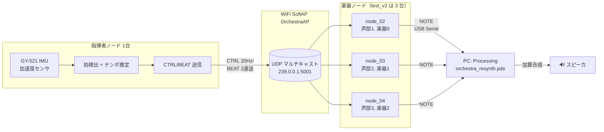
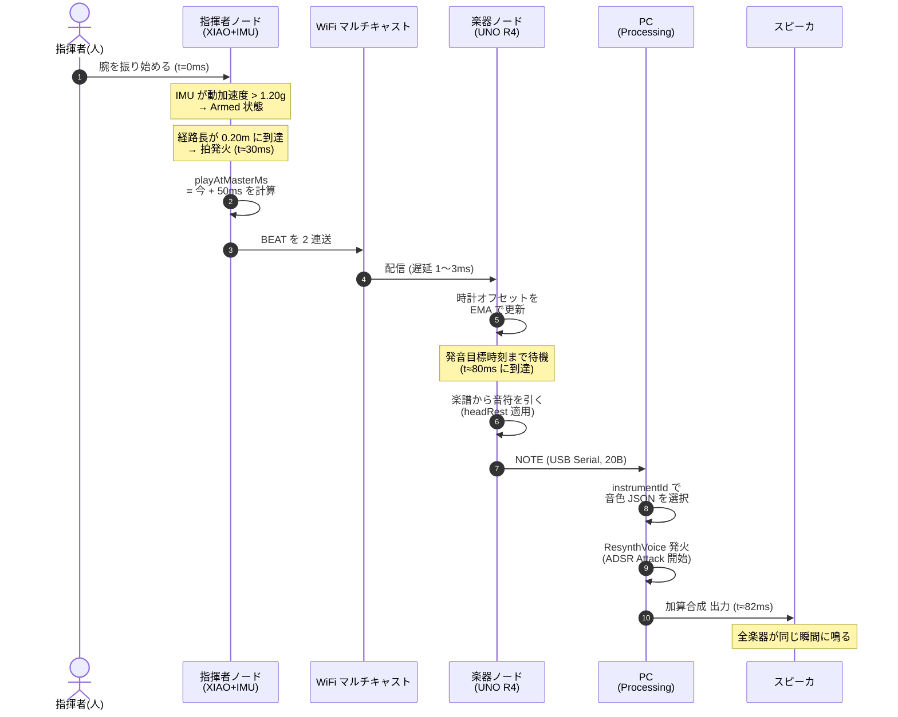
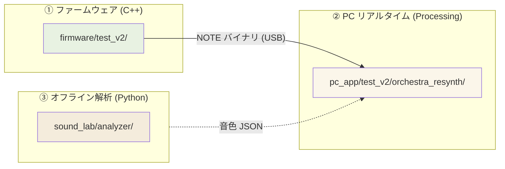
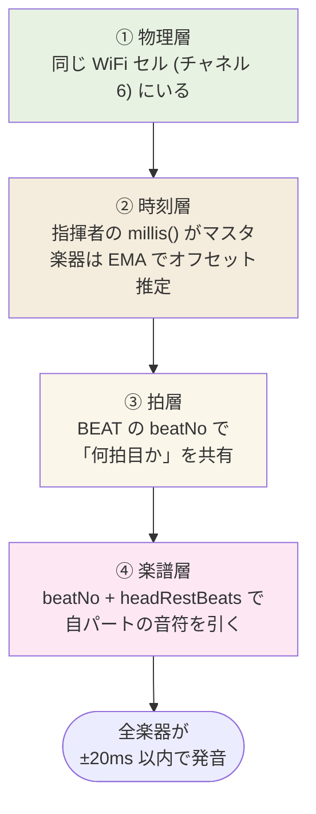

:::note[この章で分かること]
- このプロジェクトが **何台のハードを使い** 、**どうやって音が出ているか** の全体像
- 拍の合図が指揮者から PC のスピーカに届くまでの「旅」
- 「ファーム / Processing / 解析」の 3 つが **どう繋がっているか** の見取り図
:::

:::tip[読了目安]
**約 10 分**。前提知識は不要。マイコンや音響の経験がなくても読めるように書いた。
:::

:::caution[このページの位置づけ]
このページは **「これさえ読めば、誰でも仕組みが分かる」** ことを目指したダイジェスト。
詳しい数式・コード・閾値の根拠は、各章末のリンクから詳説ページに進んでほしい。
:::

## 1 行でいうと

**Arduino 5 台 + PC 1 台で動く、指揮者の腕の振りに合わせて演奏する電子オーケストラ**。

- 指揮者役のマイコン（1 台）が IMU で腕の振りを読む
- 楽器役のマイコン（**現行 test_v2 は 3 台、production 想定は 4 台**）が、拍に合わせて自分の楽譜を進める
- PC が楽器マイコンからの音符情報を受け取り、音色を作ってスピーカで鳴らす

> 音楽未経験の人がいきなり「指揮者」を任されても、振るだけで演奏が成立する。
> そこが見せ場。

## 全体図



> この図は **現行 test_v2（楽器 3 台）** の構成。
> production 想定では `node_05` を追加して 4 台構成にする予定（本実装未着手）。

この絵には、後で何度も出てくる **3 種類のパケット** が描いてある。

| パケット | 流れる向き | 何を伝える |
|---|---|---|
| **CTRL** | 指揮者 → 楽器（WiFi、20 Hz 連続） | 「今の BPM はこれくらい / 強さはこれくらい / 状態はこれ」 |
| **BEAT** | 指揮者 → 楽器（WiFi、拍ごとに 2 連送） | 「○拍目を、指揮者時計の T 時に鳴らして」 |
| **NOTE** | 楽器 → PC（USB シリアル、音符ごと） | 「楽器ID 0 で、MIDI 60 を 0.5 秒、強さ 80 で鳴らして」 |

CTRL は **常に流れている川**、BEAT は **拍ごとのスタンプ**、NOTE は **音 1 つ 1 つのチケット**、と
イメージすると掴みやすい。

## 登場人物（ハードウェア）

### 指揮者ノード — XIAO ESP32-S3 Sense + GY-521

- 役割: 指揮棒に取り付けて、振りを感知する **目利き役**
- ハード: 小型 ESP32 ボード + 外付け IMU（MPU6050 系）
- やること:
  1. 加速度を 200 Hz で読む（5 ms 周期）
  2. 「今、振りの折り返しが起きた」と判定する
  3. 拍と拍の間隔から **テンポ（BPM）** を推定する
  4. WiFi で全楽器に **CTRL/BEAT** を放送する

> 指揮者は **PC に繋がっていない**。USB は給電だけで、通信は全部無線。
> このおかげで「指揮台に立って自由に動ける」演出ができる。

### 楽器ノード — Arduino UNO R4 WiFi（現行 test_v2 は ×3、production 想定は ×4）

- 役割: 自分の楽譜を抱えていて、拍が来たら鳴らす **演奏者役**
- ハード: UNO R4 WiFi（IMU は使わない、WiFi モジュールだけ）
- やること:
  1. 指揮者からの **BEAT** を WiFi で受信する
  2. 自分の楽譜（コード内に直書き）から **「今の拍に対応する音符」** を取り出す
  3. PC に **NOTE**（USB シリアル）で「この音をこの時間、この強さで鳴らして」と頼む

> 楽器ノード（現行 3 台 / 本番想定 4 台）はすべて **同じ楽譜データ** を持っている。
> ただし、ノードごとに **頭ずらし（headRest）** が違うから、輪唱として聞こえる。

### PC アプリ — Processing 4

- 役割: 楽器ノードからの音符を受け取り、**音色を作ってスピーカに送る役**
- やること:
  1. USB シリアルで NOTE バイナリを受信
  2. NOTE の `instrumentId` を見て、対応する **音色 JSON** を選ぶ
  3. **加算合成**（倍音を足し合わせる方式）で波形を作る
  4. ADSR エンベロープで自然な「ふくらみ・減衰」を付ける
  5. 複数音を同時に鳴らせるように **ボイス管理** する

## 1 拍が鳴るまでの旅

「指揮者がタクトを 1 回振ってから、PC のスピーカから音が出るまで」を、登場人物の
やり取り図で追う。



ポイントは **「指揮者の拍の瞬間より、少し未来に鳴らす」** という発想。
30〜50 ms ぶんの余裕を持たせるから、ネットワーク遅延がブレても全楽器が **同じ瞬間** に鳴る。
これを **「playAtMasterMs 先読み」** と呼んでいる。

### playAtMasterMs 先読みのイメージ

```
時間 ─────────────────────────────────►

[指揮者]
  拍発火              ┃
   t=30ms             ┃ playAtMasterMs = 80ms
                      ┃
[楽器A]               ┃     (受信〜オフセット計算)
  受信 t=33ms ──→ ━━━━┛ 発音 t=80ms ✓
[楽器B]               ┃     (受信遅延 +2ms)
  受信 t=35ms ──→ ━━━━┛ 発音 t=80ms ✓
[楽器C]               ┃     (受信遅延 +1ms)
  受信 t=34ms ──→ ━━━━┛ 発音 t=80ms ✓
                      ▲
                      └── 全楽器が同じ瞬間 (80ms) に揃って発音
```

> たとえ受信に 1〜3 ms のばらつきがあっても、**全員が同じ未来時刻** を目指すので、
> 発音タイミングは揃う。これが「±20 ms 同期目標」を実現する核。

## なぜこの構成なのか

設計判断の核を 3 つだけ書く。詳しくは ADR と詳説ページに譲る。

### ① 指揮者と楽器を **WiFi マルチキャスト** で繋いだ理由

- 有線だと「指揮者が動けない」演出の魅力が消える
- Bluetooth は 1 対多の同時送信が苦手 / 帯域もシビア
- WiFi マルチキャストなら **1 回の送信で全楽器に同時配信** できて、遅延も実測 1〜3 ms

詳細: [ADR-0002 通信プロトコルに UDP を選んだ理由](/decisions/0002-protocol-udp/)

### ② 拍検出を **「振りの経路長」** で判定する理由

- 加速度の山の高さ（ピーク値）だけで判定すると、振りの速さで誤検知する
- 加速度を時間方向に積分（＝経路長）すれば「**振り幅** が一定値を超えた瞬間」を取れる
- 振りの方向（縦・横・斜め）に依存せず、ノルムだけで拾える

詳細: [拍検出アルゴリズム](/deep-dive/beat-detection/)

### ③ 楽譜をマイコン内蔵にし、**拍番号同期** にした理由

- 楽譜を毎回 WiFi で配信するのは帯域がもったいない
- 拍番号 `beatNo` だけ共有すれば、楽器側で「自分のパート、何拍目を鳴らすか」を計算できる
- **曲の長さで mod 演算** するから、デモ途中で PC を再起動しても「今の拍」から鳴り始める

詳細: [楽譜進行ロジック](/deep-dive/score-progression/)

## ファーム / Processing / 解析 の役割分担

このプロジェクトのソースは大きく 3 つの世界に分かれる。



| 世界 | 言語 | 何を担当するか | リアルタイム性 |
|---|---|---|---|
| ① ファームウェア | C++ (Arduino) | 指揮者の振り検出・楽器の楽譜進行・通信全般 | 必須（5 ms ループ） |
| ② PC リアルタイム | Processing 4 (Java) | NOTE 受信・加算合成・スピーカ出力 | 必須（音切れ厳禁） |
| ③ オフライン解析 | Python (librosa + numpy) | 実楽器の録音から **音色 JSON** を作る | 不要（事前処理） |

**③ と ② を繋ぐのは 1 つの JSON ファイル** だけ。
解析側は Python 以外で書き直しても、JSON 仕様さえ守れば ② はそのまま動く。
この **疎結合** が、後からの差し替えを容易にしている。

## 同期の精度目標

| 指標 | 目標値 | 何のために |
|---|---|---|
| MOP-1: 楽器間の発音ズレ | ≤ 20 ms | 聴覚的に「同時に鳴った」と感じる限界（[ADR-0006](/decisions/0006-sync-error-moe-20ms/)） |
| MOP-2: 通信遅延（指揮者 → 楽器） | ≤ 10 ms | 拍の先読み 50 ms に十分収まる範囲 |

実機測定では現状 **どちらもクリア** している（test_v2 で「きらきら星」3 声輪唱が成立）。

### 同期は 4 つの層で成立している



> どれか 1 層が欠けると同期は崩れる。逆に言うと、デバッグ時に **どの層で落ちているか** を
> 切り分ければ問題を絞り込める。

## 用語ミニ辞典

このページ以降、何度も出てくる用語をまとめておく。

| 用語 | 意味 |
|---|---|
| **指揮者ノード** | XIAO ESP32-S3 Sense + 外付け IMU の組。`firmware/test_v2/node_01/` |
| **楽器ノード** | Arduino UNO R4 WiFi。`firmware/test_v2/node_02〜04/` |
| **EMA**（Embedded-Module-Architecture） | ファームの設計パターン。3 フェーズループ + SystemData |
| **CTRL / BEAT / NOTE** | UDP / シリアルで流れる 3 種類のパケット |
| **`playAtMasterMs`** | BEAT に書かれた「指揮者時計上の発音目標時刻」 |
| **`headRestBeats`** | 楽器ノードごとの「曲の頭で何拍休むか」（輪唱の頭ずらし） |
| **`instrumentId`** | NOTE に載る楽器番号。PC 側で音色 JSON のキーになる |
| **加算合成** | 倍音（整数倍周波数）を足し合わせて波形を作る合成方式 |
| **ADSR** | Attack / Decay / Sustain / Release。音の立ち上がりと減衰の形 |

## 次に読むべきページ

このページで全体感が掴めたら、興味のある層を選んで深掘りに進む。

| 知りたいこと | 行き先 |
|---|---|
| ファーム（マイコン）の中身 | [②ファームウェアのあらまし](/essentials/firmware/) |
| Processing の中身 | [③Processing のあらまし](/essentials/processing/) |
| 音声解析（JSON 生成）の中身 | [④音声解析のあらまし](/essentials/analyzer/) |
| ブロック図をもう一段細かく | [アーキテクチャ > 全体図](/architecture/overview/) |
| なぜ IMU を選んだか・なぜ UDP か | [意思決定の記録（ADR）](/decisions/) |
| いきなりコードを読みたい | [リポジトリ・マップ](/code/map/) |

このダイジェスト 4 本（①〜④）を全部読めば、詳細群（`deep-dive/` / `firmware/` / `pc-audio/`）に
入っても「何を読まされているか」が分かる状態になる。
