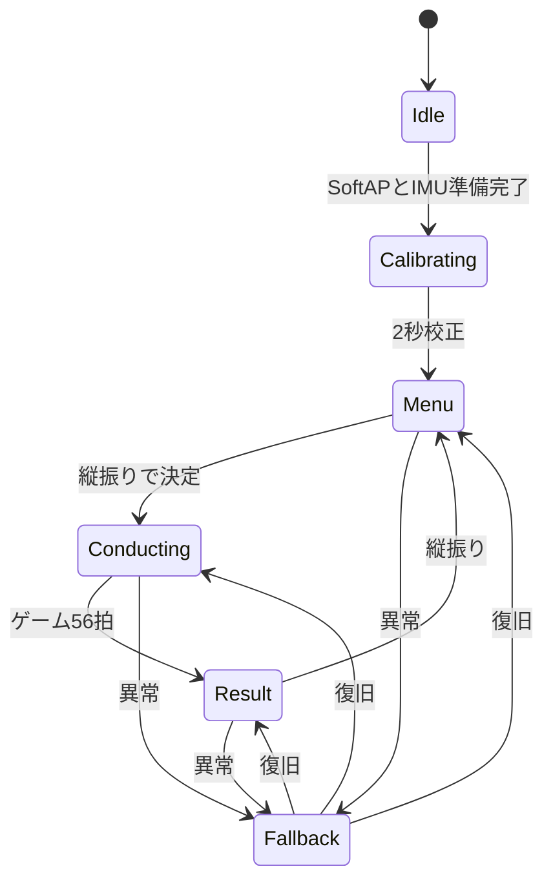
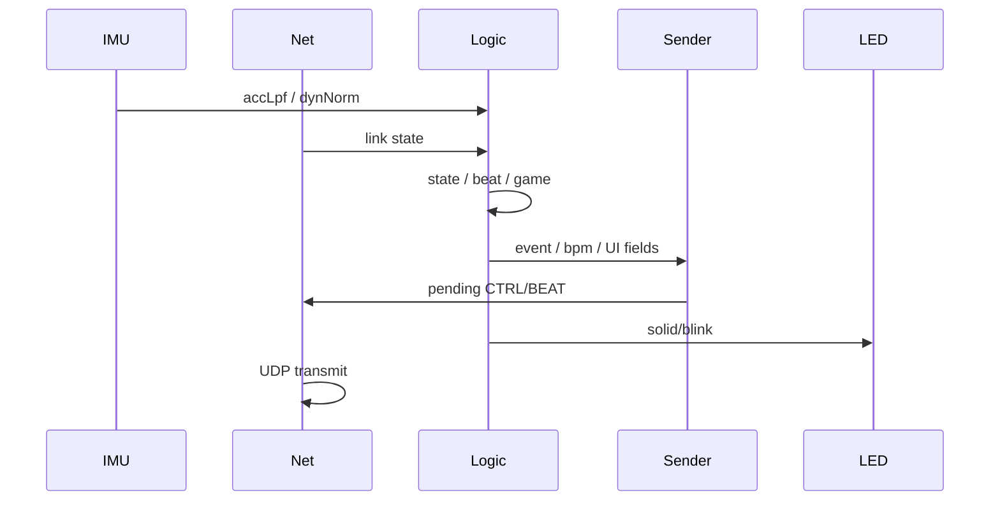

## 実体

| ファイル | 行数 | 内容 |
|---|---:|---|
| `firmware/production/node_01/src/main.cpp` | 161 | オブジェクト、setup、loop、診断 |
| `firmware/production/node_01/src/applyPattern.cpp` | 623 | 状態、拍、ナビ、採点、LED |
| `include/SystemData.h` | — | 共有状態 |
| `include/ProjectConfig.h` | — | 全設定値 |

## オブジェクト構成

```text
入力:
  ImuModule
  OrcNetModule

ロジック:
  applyPattern(SystemData&)

出力:
  OrcSenderModule
  StatusLedModule
  OrcNetModule
```

OrcNetModuleは受信と送信を持つため両フェーズへ参加します。

## `setup()`

1. Serialを115200で開始
2. LED、IMU、Wi-Fi、送信モジュールを順に初期化
3. SoftAP `OrchestraAP`を開始
4. `SystemData`の初期状態をIdleへ設定
5. 各モジュールの初期化結果を確認
6. 初期化失敗時もループ自体は維持し、Fallbackで復旧を試す

XIAOのUSB CDCはホストが開くまで待つ場合がありますが、演奏開始を永久に止めない上限を持ちます。

## `loop()`の順番

```cpp
imu.updateInput(data);
net.updateInput(data);

applyPattern(data);

sender.updateOutput(data);
led.updateOutput(data);
net.updateOutput(data);
```

入力で取った同一周期のIMU・ネット状態に対し、ロジックを1回だけ実行し、出力へ反映します。
送信モジュールをnet出力より先に呼ぶことで、同じ周期に組み立てたCTRL/BEATを即送信できます。

## 校正

Calibrating中は静止加速度ノルムを2秒間平均し、`gravityMag`を確定します。
軸ごとの姿勢を固定せずスカラー重力を使うため、持ち方が変わっても動加速度判定を共通化できます。

## 状態機械



Fallbackへ入る前の状態を保存し、復旧時にそこへ戻します。

## メニューナビ

Menu/Resultでは拍検出を止め、重力基準の縦横判定を動かします。

1. 遅いLPFで重力ベクトルを推定
2. 振り中は重力推定を凍結
3. 振り加速度を重力軸成分と水平面成分へ分解
4. 250 ms窓で絶対量を積算
5. `vertical >= horizontal × 0.55`なら縦
6. 縦は決定、横はカーソル移動

状態遷移後600 msはデッドタイムとし、決定の振り戻しを次の拍や操作に数えません。

## Conducting

### 拍ゲート

- dynNormが1.20 g超でArmed
- 経路長0.20 m到達で発火
- 350 ms不応期
- リリース40 msデバウンス
- 800 msタイムアウト
- 1 Armedセッション1発

### BPM

最初の拍は100 BPM。2拍目で実測間隔を採用し、以後EMA係数0.30で更新します。
40〜240 BPMへ制限します。

### ゲーム

mode=1では拍ごとに目標100 BPMとの差を累積します。ガイドは16拍まで100%、32拍で0%。
56拍目で0〜100点を確定しResultへ移ります。

## CTRLとBEATへの受け渡し

ロジックは`data.beat.event`、BPM、状態、ゲーム値を更新するだけです。
OrcSenderModuleが20 Bへ梱包し、OrcNetModuleが送ります。状態遷移時は`forceCtrlSend`で即時通知します。

## LED

| 状態 | 表示 |
|---|---|
| Idle | 1000 ms周期 |
| Calibrating | 500 ms周期 |
| Menu | 300 ms周期 |
| Conducting | 点灯。ゲームガイド中は目標周期 |
| Result | 120 ms周期 |
| Fallback | 200 ms周期 |

XIAOのLEDはactive LOWなので、モジュールが論理点灯を物理LOWへ変換します。

## 1周期のデータフロー



## デバッグ

`SERIAL_DEBUG=1`では状態、IMU、拍、BPM、Wi-Fi、送信統計を出します。
5 ms入力周期を崩さないよう、常時大量出力は避けます。

## 変更時の注意

- 状態遷移は必ずデッドタイムと`forceCtrlSend`を考慮する
- 数値は`ProjectConfig.h`へ置く
- 発火済みでもリリースまでArmedを維持する
- ゲーム終了拍と輪唱サイクル56を揃える
- node_01とnode_01_devkitcのロジック差を作らない

関連：[拍検出](/deep-dive/beat-detection/) / [ゲーム数式](/deep-dive/game-navigation-scoring/)
