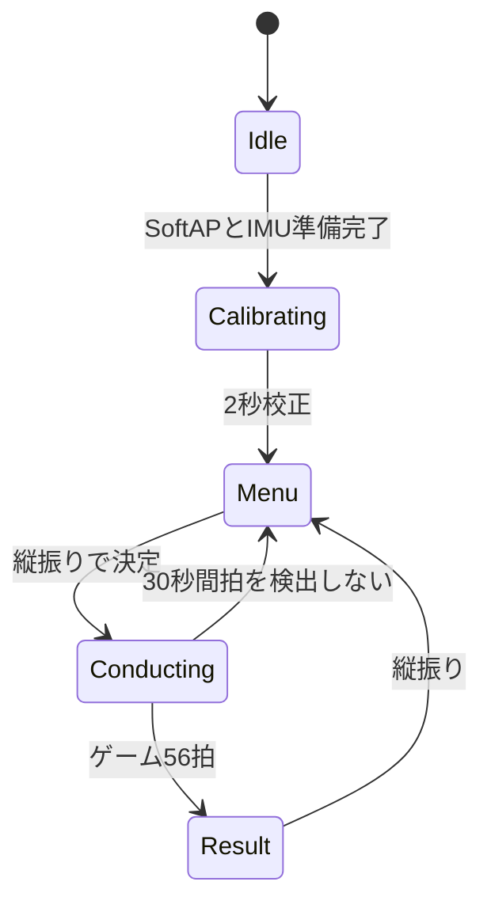

## 役割

`firmware/production/node_01/src/main.cpp`は、指揮者の各モジュールを登録し、毎ループを**入力 → ロジック → 出力**の順で実行します。状態遷移と拍検出の中心は`applyPattern.cpp`です。

```text
入力     IMU / StatusLedModule / OrcNetModule
ロジック applyPattern
出力     OrcSenderModule / StatusLedModule / OrcNetModule
```

OrcNetModuleは受信と送信の両方を持つため、入力と出力の両フェーズへ参加します。

## `setup()`

1. Serialを115200で開始する
2. LED、IMU、Wi-Fi、送信モジュールを順に初期化する
3. SoftAP `OrchestraAP`を開始する
4. `SystemData`の初期状態をIdleへ設定する
5. 各モジュールの初期化結果を確認する

XIAOのUSB CDCはホストが開くまで待つ場合がありますが、演奏開始を永久に止めない上限を持ちます。

## `loop()`の順番

```cpp
imu.updateInput(data);
net.updateInput(data);

applyPattern(data);

sender.updateOutput(data);
led.updateOutput(data);
net.updateOutput(data);
```

入力で取った同一周期のIMU・ネット状態に対し、ロジックを1回だけ実行し、出力へ反映します。送信モジュールをnet出力より先に呼ぶため、同じ周期に組み立てたCTRL/BEATをすぐ送信できます。

## 状態機械



`Fallback`はプロトコル互換性のための状態値として残っていますが、productionではIMUの一時的な瞬断で演奏が遮られることを避けるため、自動遷移を無効化しています。

## 校正とメニュー

Calibrating中は静止加速度ノルムを2秒間平均し、`gravityMag`を確定します。軸ごとの姿勢を固定せずスカラー重力を使うため、持ち方が変わっても動加速度判定を共通化できます。

Menu/Resultでは拍検出を止め、重力基準の縦横判定を使います。

1. 遅いLPFで重力ベクトルを推定する
2. 振り中は重力推定を凍結する
3. 振り加速度を重力軸成分と水平面成分へ分解する
4. 250 ms窓で絶対量を積算する
5. 縦振りは決定、横振りはカーソル移動にする

状態遷移後600 msはデッドタイムとし、決定の振り戻しを次の拍や操作に数えません。

## Conducting

### 拍ゲート

- dynNormが1.20 g超でArmed
- 経路長0.20 m到達で発火
- 350 ms不応期
- リリース40 msデバウンス
- 800 msタイムアウト
- 1 Armedセッション1発

### BPMとゲーム

最初の拍は100 BPM、2拍目で実測間隔を採用し、以後EMA係数0.30でBPMを更新します。BPMは40〜240へ制限します。

ゲームでは目標100 BPMとの差を拍ごとに積算し、56拍目で0〜100点を確定します。ガイドは16拍まで100%、32拍で0%になります。

## CTRLとBEATへの受け渡し

ロジックは`data.beat.event`、BPM、状態、ゲーム値を更新するだけです。OrcSenderModuleが20 Bへ梱包し、OrcNetModuleが送ります。BEATは4連送され、220 ms先の発音予約時刻を持ちます。状態遷移時は`forceCtrlSend`で最新の画面状態を即時通知します。

## LED

| 状態 | 表示 |
|---|---|
| Idle | 1000 ms周期 |
| Calibrating | 500 ms周期 |
| Menu | 300 ms周期 |
| Conducting | 点灯。ゲームガイド中は目標周期 |
| Result | 120 ms周期 |

XIAOのLEDはactive LOWなので、モジュールが論理点灯を物理LOWへ変換します。

関連：[指揮者ノード](/implementation/conductor/) / [拍検出アルゴリズム](/implementation/beat-detection/) / [同期方式](/system/synchronization/)
