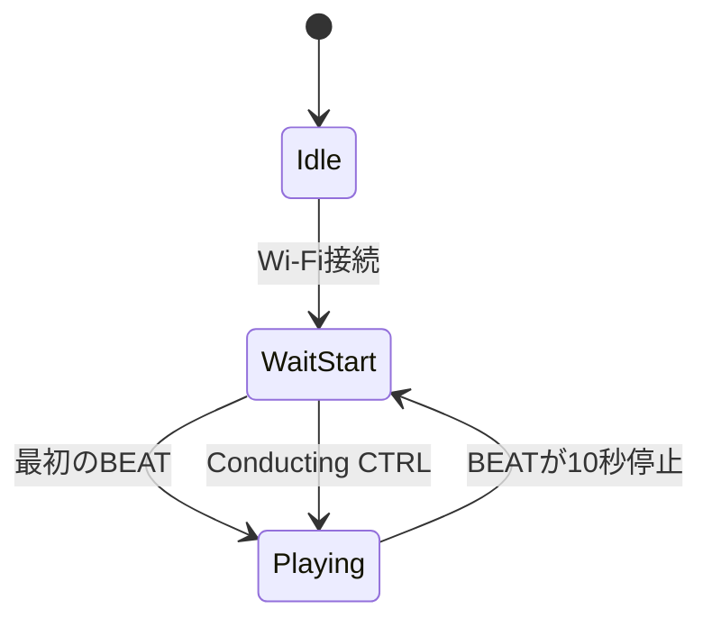

## 実体

| ファイル | 行数 | 内容 |
|---|---:|---|
| `firmware/production/node_02/src/main.cpp` | 170 | 初期化、3フェーズloop、ログ |
| `firmware/production/node_02/src/applyPattern.cpp` | 202 | 状態、予約時刻、楽譜、細分音符 |
| `node_02〜05/src/score_data.cpp` | 各32イベント | かえるのうた |
| `node_06/src/score_data.cpp` | 56イベント | ドラム |

node_03〜05はnode_02と同じ処理でConfigだけが異なります。node_06も同じ進行ロジックを使い、楽譜だけが別です。

## モジュール構成

```text
入力:
  OrcNetModule
  OrcReceiverModule

ロジック:
  applyPattern(SystemData&)

出力:
  NoteSenderModule
  UiRelayModule（node_02のみ）
  StatusLedModule
  OrcNetModule
```

## `setup()`

1. Serialを115200で開始
2. LEDとWi-Fi Stationを初期化
3. OrcReceiverとNoteSenderを初期化
4. node_02のみUiRelayを初期化
5. Idle状態でループ開始

SSID、パスワード、マルチキャスト、partId、頭ずらし、音色番号は`ProjectConfig.h`から渡します。

## 2 msループ

```cpp
net.updateInput(data);
receiver.updateInput(data);

applyPattern(data);

noteSender.updateOutput(data);
uiRelay.updateOutput(data);  // node_02
led.updateOutput(data);
net.updateOutput(data);
```

`loopIntervalMs=2`で発音予約の判定ジッタを最大約2 msへ抑えます。`delay(2)`固定ではなく経過時間で周期を制御します。

## 楽器状態



頭の休符はWaitStartではなくPlaying内の楽譜位置計算で表現します。

## 発音予約

OrcReceiverが`PendingBeat`へ`beatNo`と`playAtMasterMs`を置きます。

```text
targetLocalMs = playAtMasterMs - offsetMs
waitMs = targetLocalMs - millis()
```

`waitMs > 0`なら次周期まで待ち、`<= 0`なら即発火します。遅着した拍を捨てると欠音になるため、期限切れでも鳴らします。

## 楽譜位置

```text
cyclePos = (beatNo - 1) mod 56
local = cyclePos - headRestBeats
```

- local < 0：入り前
- 0〜31：金管は`kScore[local]`
- 32以上：その声部はサイクル末尾まで休み
- node_06：56イベント全部を使用

毎拍`beatNo`から再計算するので、欠損後も次の拍で自己修復します。

## 音価とvelocity

```text
durationMs = durationQ8 / 256 × 60000 / BPM
velocityOut = scoreVelocity × ctrlVelocity / 127
```

BPMが不正なら既定100を使います。計算結果は`uint16_t`へ収まるよう上限を設けます。

## 細分音符

`subNote != 0`なら、拍頭から`subOffsetQ8`ぶん遅い時刻を`pendingSubAtMs`へ予約します。
主音符の`noteOut`と細分音符の`noteOutSub`は別スロットで、同一周期の衝突を防ぎます。

## node_02のUI中継

node_02だけが`CtrlData`をUIパケットへ変換します。変化時は最短33 ms間隔、無変化でも1000 msごとに送り、
PCの途中接続とタイムアウト判定を支えます。NOTE送信とは別モジュールです。

## ドラム

node_06は56拍すべてを進めます。GM番号36=キック、38=スネア、49=クラッシュ。
声部開始0/8/16/24拍と区切り32/40/48拍でクラッシュ、終盤にスネアフィルを置きます。

## LED

Idleは1000 ms、WaitStartは500 ms周期、Playingは点灯です。UNO R4のLEDはactive HIGHです。

## 異常系

- Wi-Fi切断：OrcNetが再接続を試行
- CTRL停止：最後のBPMを保持
- BEAT停止10秒：WaitStartへ戻る
- マスタ再起動：offsetをスナップし、新しいbeatNoへ合流
- PC停止：Serial送信は続くが、再接続後は現在位置から鳴る
- NOTE遅延：楽譜カウンタではなく次のbeatNoで修復

## 変更時の注意

- node_02〜05の`score_data.cpp`を同じ内容に保つ
- `CANON_CYCLE_BEATS=56`を全楽器で一致させる
- partIdとNoteSenderのpartIdを一致させる
- instrumentIdとPC側JSON順を一致させる
- node_02以外へUiRelayを追加すると複数メインUIが競合する

関連：[楽譜進行](/deep-dive/score-progression/) / [UiRelay](/firmware/ui-relay/)
