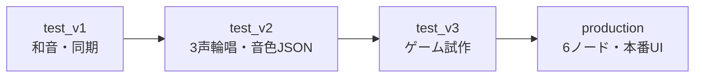

## 現在の扱い

| バージョン | 目的 | 現在の位置づけ |
|---|---|---|
| test_v1 | UDP同期の最小検証 | 凍結した参考実装 |
| test_v2 | 3声輪唱と音色番号の検証 | 凍結した参考実装 |
| test_v3 | production前のゲーム機能検証 | 移植元・参考実装 |
| production | 4声輪唱＋ドラム＋ゲーム | **現行・本番版** |

新しい説明、動作確認、機能追加はproductionを基準にします。

## 主な進化

- 楽器数：3台 → 5台
- 曲：きらきら星 → かえるのうた
- 声部：3声 → 金管4声 + ドラム
- パケット：CTRL／BEAT／NOTE → UIを追加
- 操作：演奏のみ → IMUメニュー、自由演奏、ゲーム、結果
- PC：単純画面 → メインUI／アナライザ自動判定と共通タブ化

旧版の値をproductionへコピーすると、パケット・状態・楽譜周期が合わない場合があります。
