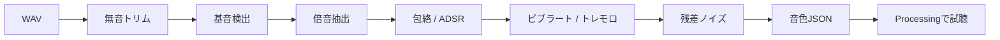

## 目的

実楽器の録音から基音、倍音、包絡、揺れ、ノイズを抽出し、Processingの加算合成で使えるJSONへ変換します。

## パイプライン

解析コアは`sound_lab/analyzer/analyzer.py`です。librosaのpyin、自己相関、FFT、STFTなどを使います。

## productionへ入れるまで

1. 単音WAVを解析する
2. `sound_lab`側で試聴・調整する
3. JSONの構文と音量を確認する
4. `pc_app/production/orchestra_resynth/data/`へ番号付きでコピーする
5. `instrumentId`の対応を確認する
6. 単音だけでなく合奏音量で試験する

解析結果は自動的な正解ではありません。発表環境のスピーカーと複数声部で聴感調整します。
