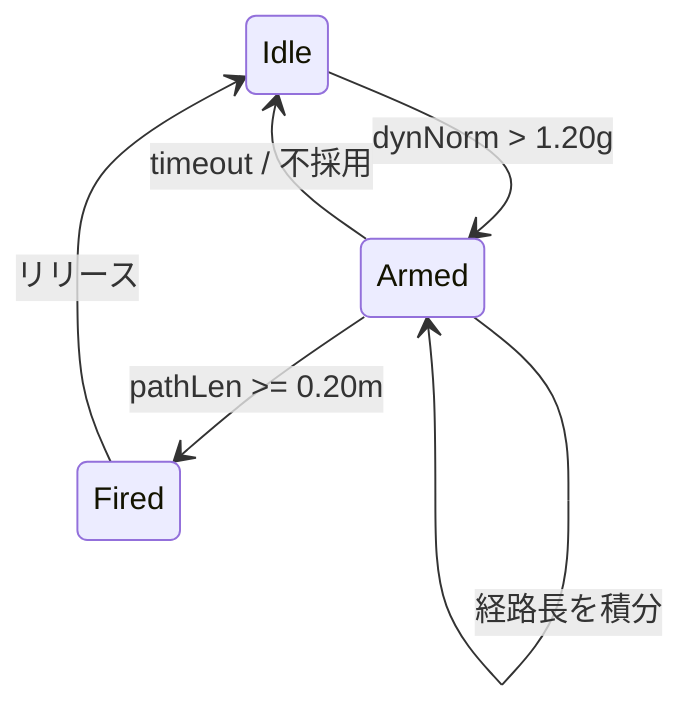

## 処理順

1. 5 msごとに3軸加速度を取得
2. LPF（係数0.10）で瞬間ノイズを抑える
3. 校正済み重力ノルムを引いて動加速度ノルムを作る
4. 1.20 g超でArmedへ入る
5. 速度相当値を積分し、経路長0.20 mで発火
6. リリースまたは800 msタイムアウトまで同じ振りを保持
7. 350 msの不応期で戻し動作の二重発火を防ぐ

## 状態

実装では発火後もArmedを維持し、同じ振りの途中で再Armedしないようにします。

## BPM

拍間隔からBPMを求め、40〜240へ制限したうえでEMA係数0.30で更新します。
最初の拍は間隔がないため100 BPMを使います。
