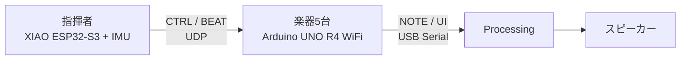

## このサイトについて

千葉工業大学ハッカソン・チーム23の作品 **タクトーン** の仕様と開発手順をまとめたサイトです。
記述対象は現在の本番版である `firmware/production/` と `pc_app/production/` です。

## 迷ったらここから

| 目的 | 読むページ |
|---|---|
| 何を作ったか知る | [プロジェクト概要](/intro/overview/) |
| システム全体を理解する | [現行システム](/system/overview/) |
| 実機を動かす | [クイックスタート](/intro/quickstart/) |
| コードを変更する | [開発ガイド](/guide/setup/) |
| 旧版との差を確認する | [バージョン変遷](/history/versions/) |

:::caution[仕様の基準]
このサイト内で食い違いが見つかった場合は、productionのヘッダー・設定・実装コードを優先してください。
ADRは「当時なぜ決めたか」を残す履歴なので、現在の実装と異なる場合があります。
:::
