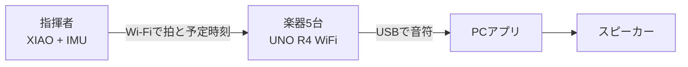

## まずこれだけ伝える

**タクトーンは、指揮棒を振るだけで、5台の楽器マイコンとPCの音がそろって演奏する Arduino オーケストラです。**

振る速さがテンポになり、曲は「かえるのうた」の4声輪唱とドラムで進みます。音楽経験がなくても、直感的な「指揮」という動作で合奏に参加できます。

:::tip[30秒で話すなら]
「私たちは、指揮を振ると複数の楽器が合奏するタクトーンを作りました。難しかったのは、Wi-Fiでは各楽器に信号が届く時刻がばらつくことです。そこで、届いた瞬間に鳴らすのではなく、全員に同じ未来の発音時刻を渡して待たせる方式にしました。実測では、楽器間の発音差の中央値を7 msまで抑えられました。」
:::

## 何が動くのか

| 部品 | 役割 |
|---|---|
| 指揮者 | 指揮の動きを読み、拍とテンポを決める |
| 楽器5台 | 同じ予定時刻に、担当パートの音符をPCへ送る |
| PC | 金管・ドラムの音を作り、画面も表示する |

金管4声（トランペット、ホルン、トロンボーン、チューバ）が8拍ずつずれて入り、ドラムが全体を支えます。自由演奏のほか、100 BPMを保てたかを採点するゲームモードもあります。

## 一番の工夫：届くのはばらばら、鳴るのは同時

Wi-Fiでは、同じ拍の信号でも各楽器への到着時刻がそろいません。そこで楽器は、信号を受け取った瞬間には鳴らしません。

1. 指揮者が「この拍は **220 ms後** に鳴らす」と送る
2. 各楽器が自分の時計を指揮者の時計に合わせる
3. 全楽器が同じ予定時刻まで待ち、音符をPCへ送る

この方式なら、通信の到着順が少し違っても、音を出す時刻をそろえられます。220 msは「反応を遅くするため」ではなく、Wi-Fiの配送ばらつきを吸収して**合奏を安定させるための予約時間**です。

## 実測で分かったこと

| 見たもの | 結果 | 発表での言い方 |
|---|---:|---|
| 拍の検出 | 120回中120回 | 「一定の指揮をすべて拍として読めました」 |
| 楽譜 | 誤ノート0件 | 「各パートが決めた楽譜どおりに進みました」 |
| 楽器間の発音差 | 中央値 **7 ms**、平均10.8 ms | 「普段は人が同時と感じる範囲より十分小さくそろいました」 |
| 予約に間に合わない受信 | 45.4% → **3.1%** | 「予約方式で通信のばらつきを大きく減らしました」 |
| パケット欠落 | 0.0% | 「最終構成の計測では拍の欠落はありませんでした」 |

:::note[数値を正確に伝える]
楽器間の発音差には、まれに最大65 msの外れ値がありました。そのため「すべての拍で20 ms以内」とは言いません。詳しい理由と答え方は[想定問答](/presentation/faq/)にまとめています。
:::

## 発表の流れ

1. **体験**：「指揮を振るだけで合奏できる」ことを見せる
2. **課題**：「複数のWi-Fi機器は同時には届かない」と説明する
3. **解決**：「同じ未来時刻を予約して待つ」と一言で説明する
4. **成果**：「中央値7 ms」「予約に間に合わない受信を3.1%へ改善」を示す
5. **誠実さ**：外れ値と未検証項目も認め、次の改善を説明する

## さらに詳しく知りたいとき

- 操作とデモの流れ：[演奏体験と状態遷移](/system/experience/)
- 仕組みを図で見る：[同期方式](/system/synchronization/)
- 数値と測定方法：[評価・検証](/guide/verification/)
- 質問に備える：[想定問答と答え方](/presentation/faq/)
