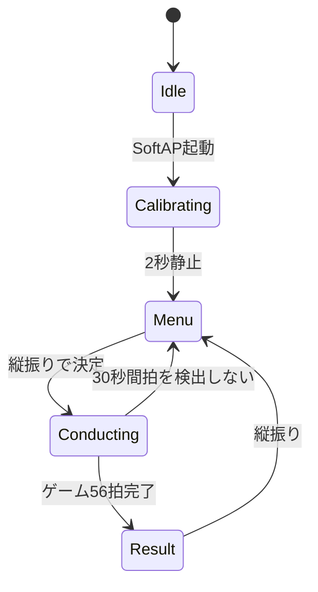

## ユーザーの流れ

1. 電源を入れ、指揮棒を約2秒静止する
2. 左右振りで「自由演奏」「ゲーム」を選ぶ
3. 縦振りで決定する
4. 指揮を振り、演奏を進める
5. ゲームでは56拍後にスコアを見る
6. 結果画面で縦に振るとメニューへ戻る

## 指揮者の状態

状態遷移直後は600 msのデッドタイムを置き、遷移を起こした振りの戻りを次の操作として誤認しないようにします。

## LED表示

| 状態 | 指揮者LED |
|---|---|
| Idle | 1 Hz点滅 |
| Calibrating | 2 Hz点滅 |
| Menu | 約1.7 Hz点滅 |
| Conducting | 点灯。ゲーム序盤はガイドテンポで点滅 |
| Result | 高速点滅 |

`Fallback`はパケット互換性のため状態値として残っていますが、productionでは実機テスト時の演奏中断を避けるため、自動的にFallbackへ入る経路を無効化しています。
