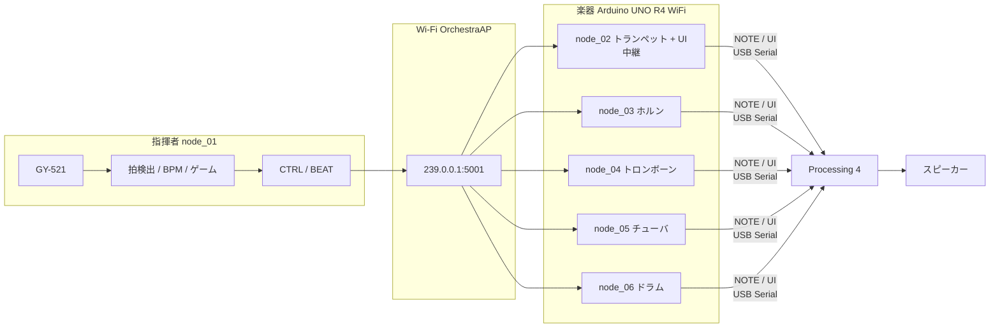

## 構成図

## 責務

| 要素 | 主な責務 |
|---|---|
| 指揮者 | IMU取得、拍検出、BPM推定、モード選択、ゲーム採点、UDP送信 |
| 金管4台 | 時刻同期、拍番号から楽譜位置を計算、NOTE送信 |
| ドラム | 56拍の専用譜を進行し、GMドラム番号をNOTE送信 |
| Processing | 複数USB受信、画面制御、金管加算合成、ドラム合成 |

## データ経路

- UDP：指揮者から楽器へ`CTRL`と`BEAT`
- USB Serial：各楽器からPCへ`NOTE`
- USB Serial：`node_02`からPCへ`UI`
- 音声：ProcessingのMinimからスピーカーへ

test_v1/test_v2は比較・参考用です。新しい作業はproductionを基準にしてください。
