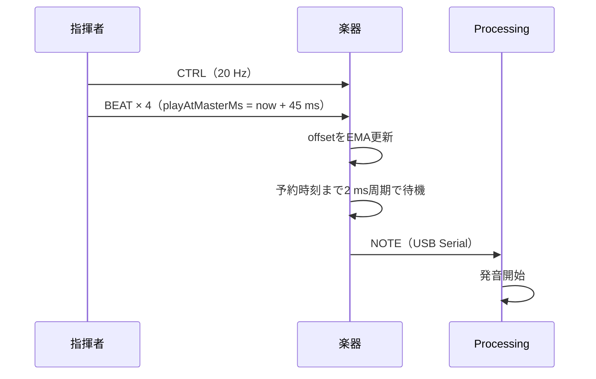

## 基本方針

指揮者の`millis()`をマスタ時計とします。楽器は受信時刻とパケットの`timestampMs`から
`master - local`のオフセットを推定し、自分の時計をマスタ時計へ変換します。

## 発音まで

## 現在の設定

| 設定 | 値 |
|---|---:|
| CTRL周期 | 50 ms / 20 Hz |
| BEAT重複数 | 4 |
| 重複間隔 | 2 ms |
| 発音先読み | 45 ms |
| 時計EMA | 新規0.20、重複0.05 |
| 同期収束サンプル | 5 |
| 楽器ループ周期 | 2 ms |
| 時計スナップ閾値 | 1000 ms |

同じ`beatNo`の重複BEATは発音を重複させず、時計補正にだけ軽く使います。
指揮者が再起動して時計が大きく戻った場合は、EMAではなく1回でスナップ追従します。

## 目標と測定

楽器間同期誤差の目標は20 ms以内です。USB受信時刻差による近似測定は
`tools/verification/`のMOP4で行います。
