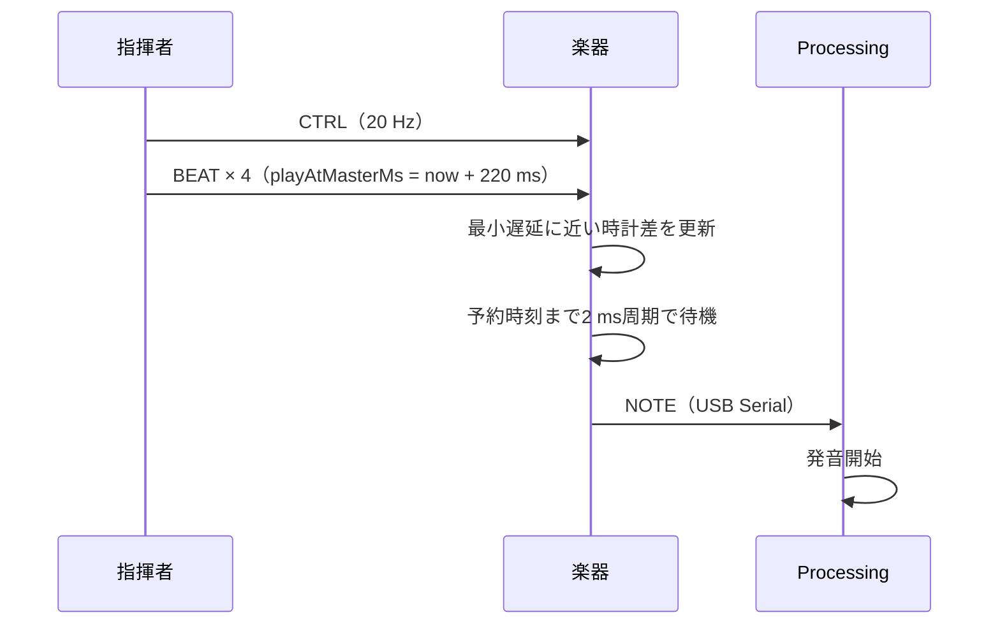

## まず考え方

Wi-Fiの信号は、各楽器へ同じ時刻には届きません。そこでタクトーンは「届いた瞬間に鳴らす」のではなく、**全楽器へ同じ未来の発音時刻を渡し、その時刻まで待つ**方式を使います。

指揮者の`millis()`を基準時計とし、楽器は受信時刻とパケットの`timestampMs`から`master - local`の時計差を推定します。

## 発音まで

## 現在の設定

| 設定 | 値 |
|---|---:|
| CTRL周期 | 50 ms / 20 Hz |
| BEAT重複数 | 4 |
| 重複間隔 | 2 ms |
| 発音先読み | 220 ms |
| 時計同期 | 2秒窓の最大offset（最小遅延サンプル） |
| 同期収束サンプル | 5 |
| 楽器ループ周期 | 2 ms |
| 時計スナップ閾値 | 1000 ms |

同じ`beatNo`の重複BEATは発音を重複させず、時計同期の観測にだけ使います。2秒の観測窓では、最も早く届いた信号に近い値を選ぶため、遅れて届いた信号に時計を引っ張られません。指揮者が再起動して時計が大きく戻った場合は、1パケットでスナップ追従します。

## 目標と測定

楽器間同期誤差の目標は20 ms以内です。最終構成では、楽器が発火した時点の推定マスタ時刻で測り、中央値7 ms、平均10.8 msでした。最大65 msの外れ値もあるため、結果と限界は[評価・検証](/guide/verification/)であわせて確認してください。
