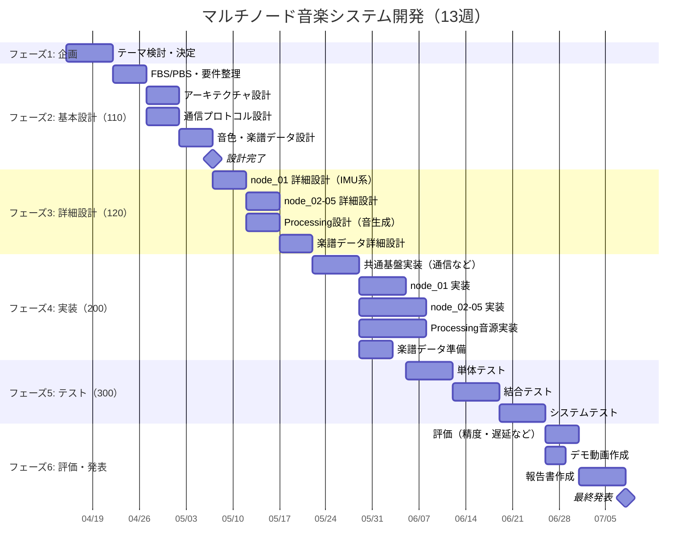

# ガントチャート（記入例）

## 全体スケジュール

```mermaid
gantt
    title マルチノード音楽システム開発（13週）
    dateFormat  YYYY-MM-DD
    axisFormat  %m/%d

    section フェーズ1: 企画
    テーマ検討・決定           :a1, 2026-04-15, 7d

    section フェーズ2: 基本設計（110）
    FBS/PBS・要件整理         :a2, after a1, 5d
    アーキテクチャ設計        :a3, after a2, 5d
    通信プロトコル設計        :a4, after a2, 5d
    音色・楽譜データ設計      :a5, after a3, 5d
    設計完了                  :milestone, after a5, 0d

    section フェーズ3: 詳細設計（120）
    node_01 詳細設計（IMU系） :b1, after a5, 5d
    node_02-05 詳細設計       :b2, after b1, 5d
    Processing設計（音生成）  :b3, after b1, 5d
    楽譜データ詳細設計        :b4, after b2, 5d

    section フェーズ4: 実装（200）
    共通基盤実装（通信など）  :c1, after b4, 7d
    node_01 実装              :c2, after c1, 7d
    node_02-05 実装           :c3, after c1, 10d
    Processing音源実装        :c4, after c1, 10d
    楽譜データ準備            :c5, after c1, 5d

    section フェーズ5: テスト（300）
    単体テスト                :d1, after c2, 7d
    結合テスト                :d2, after d1, 7d
    システムテスト            :d3, after d2, 7d

    section フェーズ6: 評価・発表
    評価（精度・遅延など）    :e1, after d3, 5d
    デモ動画作成              :e2, after d3, 3d
    報告書作成                :e3, after e1, 7d
    最終発表                  :milestone, after e3, 0d
```
## 備考

- 日付は暫定。実際の授業日程に合わせて調整する
- タスクは [3_10.md](3_10.md) と必ず対応させる
