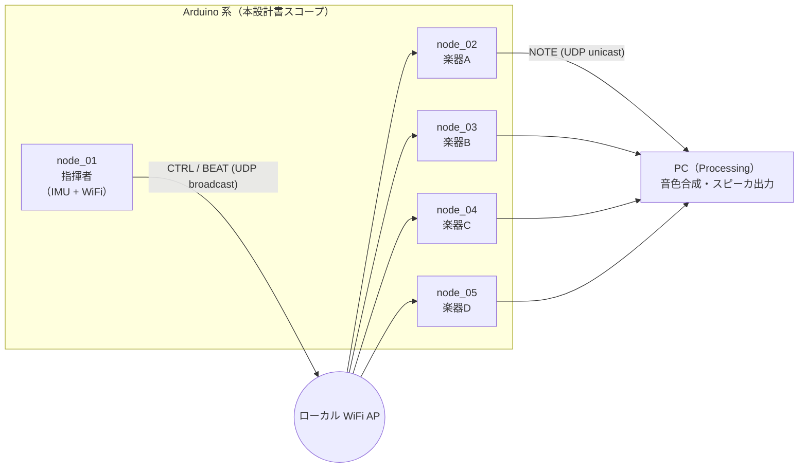
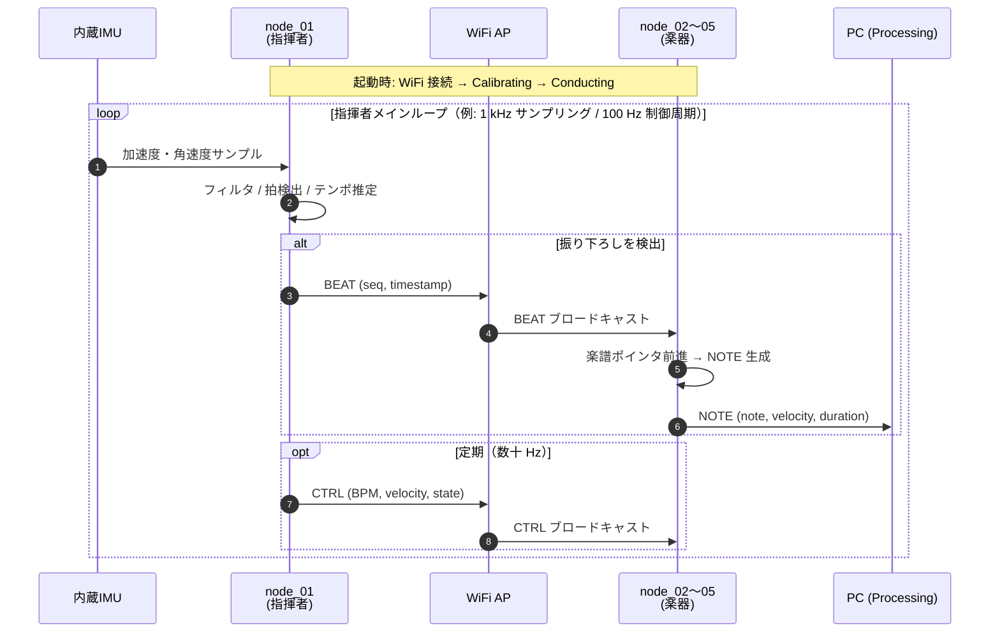

# 5. システムアーキテクチャ

## 5.1 全体構成

チーム共有の全体像（[`docs/design/architecture.md`](../../../../../docs/design/architecture.md)）を
Arduino 系視点で補強する。ローカル WiFi AP を介して指揮者 1 + 楽器 4 が接続され、
楽器は別途 PC へ NOTE を送る。

- 指揮者 → 楽器は **UDP ブロードキャスト（もしくはマルチキャスト）** で 1 対多配信する
  （通信方式の選定は第 10.3 章で詳述）
- 楽器 → PC は **UDP ユニキャスト**（Processing の待ち受けポートへ）
- PC 側の Processing と外付け音響系は本設計書のスコープ外（梅澤担当）

## 5.2 ノード役割分担

担当拡大後の最新版（[`docs/roles.md`](../../../../../docs/roles.md) も同時に更新予定）。

| ノード | 物理配置 | 主な責務 | Arduino コード担当 |
|---|---|---|---|
| node_01 | 指揮者の手先／指揮棒 | IMU 読み取り → 拍・テンポ・強弱推定 → CTRL/BEAT 送出 | **塩澤** |
| node_02 | 楽器 A | BEAT 同期で楽譜進行 → NOTE 送出（第 1 声） | **塩澤** |
| node_03 | 楽器 B | 同上（第 2 声） | **塩澤** |
| node_04 | 楽器 C | 同上（第 3 声） | **塩澤** |
| node_05 | 楽器 D | 同上（第 4 声 or リズム） | **塩澤** |
| PC | 据え置き | NOTE 受信 → 音色合成 → スピーカ出力 | 梅澤（参考） |

node_02〜05 の Arduino コードは **共通ソース + パート設定差し替え**（`ProjectConfig` と
楽譜データのみ差分）で構成する。4 台分の別コードを書き分けない（第 12 章）。

## 5.3 データフロー

演奏開始から 1 拍ぶんの情報が流れる様子をシーケンス図で示す。

- **BEAT**: 拍ごとに 1 発送信する即時性重視パケット（第 10.3 章で詳細）
- **CTRL**: BPM や強弱などの状態を定期送信する冪等パケット（取りこぼしてもすぐ次が来る）
- **NOTE**: 楽器 → PC の発音情報

## 5.4 ファームウェア設計方針（Embedded-Module-Architecture）

Arduino 側は全 5 ノードで **Embedded-Module-Architecture**（以下 EMA）に準拠する
（[ADR-0005](../../../../../docs/decisions/0005-firmware-embedded-module-architecture.md)）。

- **3 フェーズループ**: `loop()` を「入力 → ロジック → 出力」の順で実行する
- **モジュール化**: 各機能は `IModule` インターフェース（`setup()` / `update()`）を実装する
  独立クラスとして書き、`main.cpp` で順序登録する
- **状態の集約**: ノード内状態は `SystemData` に、ノード固有設定は `ProjectConfig` に集約する
- **共通層の共有**: `IModule` 基底・`ModuleTimer`・通信プロトコルは `firmware/common/lib/` に
  置き、全ノードが `lib_extra_dirs = ../common/lib` で参照する

採用理由と代替案比較は ADR-0005 に記載、API 詳細は本書第 10 章以降に落とす。
