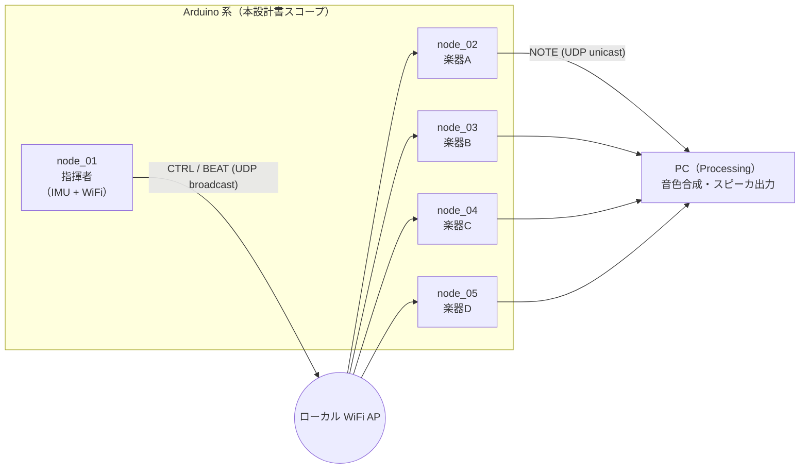
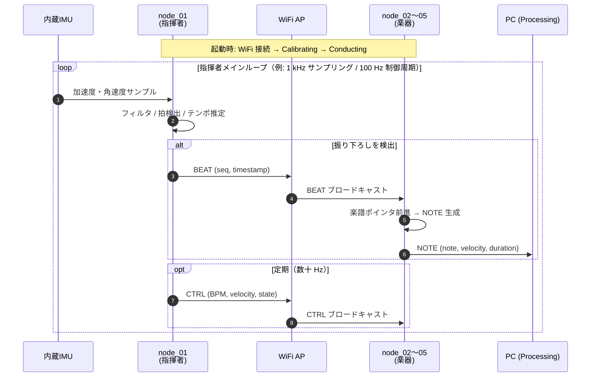

# 5. システムアーキテクチャ

## 5.1 全体構成

チーム共有の全体像（[`docs/design/architecture.md`](../../../../../docs/design/architecture.md)）を
Arduino 系視点で補強する。ローカル WiFi AP を介して指揮者 1 + 楽器 4 が接続され、
楽器は別途 PC へ NOTE を送る。

- 指揮者 → 楽器は **UDP ブロードキャスト（もしくはマルチキャスト）** で 1 対多配信する
  （通信方式の選定は第 10.3 章で詳述）
- 楽器 → PC は **UDP ユニキャスト**（Processing の待ち受けポートへ）
- PC 側の Processing と外付け音響系は本設計書のスコープ外（梅澤担当）

## 5.2 ノード役割分担

担当拡大後の最新版（[`docs/roles.md`](../../../../../docs/roles.md) も同時に更新予定）。

| ノード | 物理配置 | 主な責務 | Arduino コード担当 |
|---|---|---|---|
| node_01 | 指揮者の手先／指揮棒 | IMU 読み取り → 拍・テンポ・強弱推定 → CTRL/BEAT 送出 | **塩澤** |
| node_02 | 楽器 A | BEAT 同期で楽譜進行 → NOTE 送出（第 1 声） | **塩澤** |
| node_03 | 楽器 B | 同上（第 2 声） | **塩澤** |
| node_04 | 楽器 C | 同上（第 3 声） | **塩澤** |
| node_05 | 楽器 D | 同上（第 4 声 or リズム） | **塩澤** |
| PC | 据え置き | NOTE 受信 → 音色合成 → スピーカ出力 | 梅澤（参考） |

node_02〜05 の Arduino コードは **共通ソース + パート設定差し替え**（`ProjectConfig` と
楽譜データのみ差分）で構成する。4 台分の別コードを書き分けない（第 12 章）。

## 5.3 データフロー

演奏開始から 1 拍ぶんの情報が流れる様子をシーケンス図で示す。

- **BEAT**: 拍ごとに 1 発送信する即時性重視パケット（第 10.3 章で詳細）
- **CTRL**: BPM や強弱などの状態を定期送信する冪等パケット（取りこぼしてもすぐ次が来る）
- **NOTE**: 楽器 → PC の発音情報

## 5.4 ファームウェア設計方針（Embedded-Module-Architecture）

Arduino 側は全 5 ノードで **Embedded-Module-Architecture（以下 EMA）** に全面準拠する
（[ADR-0005](../../../../../docs/decisions/0005-firmware-embedded-module-architecture.md)）。
EMA の正本は同階層の [`../../architecture_reference/`](../../architecture_reference/) に
取り込み済み（採用元: <https://github.com/takushio2525/Embedded-Module-Architecture>）。
本節は EMA の核心ルールを「本ハッカソンに当てはめる視点」で要約する。

### 5.4.1 EMA の中核ルール（正本に従う）

| ルール | 内容 |
|---|---|
| `IModule` インターフェース | 4 メソッド `init()` / `updateInput(SystemData&)` / `updateOutput(SystemData&)` / `deinit()`。`init()` のみ純粋仮想、残り 3 つはデフォルト空実装 |
| 入出力分類 | モジュールは「入力専用」「出力専用」「入出力両方」「内部専用」の 4 種に分類し、それぞれ `inputModules[]` / `outputModules[]` の対応する配列に登録する |
| 3 フェーズ実行モデル | `loop()` は **入力配列の `updateInput()` → ロジック関数 `applyPattern(systemData)` → 出力配列の `updateOutput()`** の順で必ず実行 |
| `SystemData` 集約 | モジュール間の共有状態は `include/SystemData.h` で `{Module}Data` フィールドを並べた構造体に一元化。直接モジュール間で呼び合うことを禁止 |
| `ProjectConfig` 集約 | 各モジュールの設定は `{Module}Config {MODULE}_CONFIG = {…};` インスタンスとして `include/ProjectConfig.h` に集約。共有バスピン（SPI/I2C）のみ `constexpr` 単体定数として定義 |
| ファイル分割 | 各モジュールは必ず `lib/{Name}Module/{Name}Module.h` と `{Name}Module.cpp` に分離。`.h` では `SystemData.h` を include せず前方宣言のみ（循環依存回避） |
| 命名規則 | 型 `{Module}Config` / `{Module}Data`、インスタンス `{MODULE}_CONFIG`、ログ `[ModuleName] msg` |
| platformio.ini 必須設定 | `build_flags = -I include`（`lib/` 内から `include/` 参照のため） |

詳細は [`../../architecture_reference/ARCHITECTURE.md`](../../architecture_reference/ARCHITECTURE.md) と
[`../../architecture_reference/CLAUDE.md`](../../architecture_reference/CLAUDE.md) を参照。
本書では用語定義を再記述しない。

### 5.4.2 本ハッカソンへの当てはめ

| EMA の要素 | 本プロジェクトでの当てはめ |
|---|---|
| コア層 `lib/ModuleCore/`（プロジェクト非依存） | `firmware/common/lib/ModuleCore/`（`IModule.h`, `ModuleTimer.h`）に配置し、5 ノードで `lib_extra_dirs = ../common/lib` で共有 |
| 入力モジュール（`updateInput()` のみ） | node_01: `ImuModule`（IMU 読み取り）、`OrcReceiverModule`（UDP 受信）／ node_02〜05: `OrcReceiverModule`（CTRL/BEAT 受信） |
| 出力モジュール（`updateOutput()` のみ） | node_01: `OrcSenderModule`（CTRL/BEAT 送信）、`StatusLedModule` ／ node_02〜05: `OrcSenderModule`（NOTE 送信）、`StatusLedModule` |
| 入出力モジュール（両配列に登録） | `OrcNetModule`（WiFi 接続維持＋送受信ポーリング、両配列に入れ「先に受信、最後に送信」を制御） |
| 内部専用モジュール（配列に入れない） | 該当なし（DriveMotor のような子モジュールは本プロジェクトでは発生しない） |
| ロジック関数 `applyPattern(systemData)` | node_01: 信号フィルタ → 拍検出 → テンポ推定 → 強弱推定 → 状態遷移 ／ node_02〜05: 楽譜進行・発音フラグ立て・SelfRun 判定 |
| `SystemData` の {Module}Data | 第 11 章 / 第 12 章で具体化（例: `ImuData`, `OrcNetData`, `OrcReceiverData`） |
| `ProjectConfig` の {MODULE}_CONFIG | 第 11 章 / 第 12 章で具体化（例: `IMU_CONFIG`, `ORC_NET_CONFIG`, `ORC_RECEIVER_CONFIG`） |
| ロジック中間状態 | `applyPattern()` の中間結果は専用 `{Logic}Data` 構造体（`BeatLogicData`, `TempoLogicData`, `ScoreLogicData` 等）として `SystemData` に集約 |

> **注**: 「拍検出」「テンポ推定」「楽譜進行」のような **入力でも出力でもない判断ロジック**
> は、EMA の流儀では `IModule` の派生クラスとして並べず、`applyPattern(systemData)`
> 関数の中で SystemData を読み書きする手続きとして実装する。
> モジュールはあくまで「ハードウェア（IMU・UDP・LED）に触れる責務」を担当する単位。

採用理由と代替案比較は ADR-0005 に記載、API 詳細は本書第 10 章以降に落とす。
