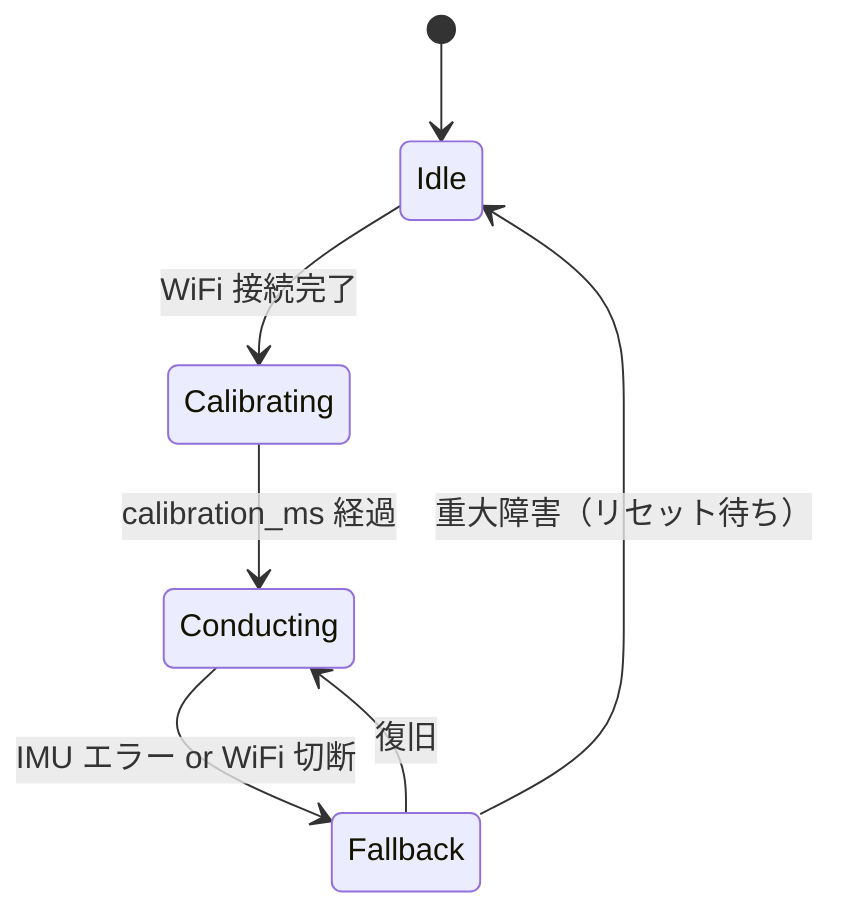

# 11. 指揮者ノード（node_01）詳細設計

## 11.1 `SystemData` / `ProjectConfig`

```cpp
// firmware/node_01/src/SystemData.h
#pragma once
#include <stdint.h>

enum class ConductorState : uint8_t {
    Idle        = 0,
    Calibrating = 1,
    Conducting  = 2,
    Fallback    = 3,
};

struct SystemData {
    // F1.1 IMU 生値
    float acc_raw[3];
    float gyro_raw[3];
    uint32_t last_sample_ms;

    // F1.2 前処理後
    float acc_filtered[3];
    float acc_norm;         // |acc_filtered|

    // F1.3 拍検出
    bool  beat_event;        // このフレームで拍を検出したか
    uint16_t beat_no;        // 曲頭からの拍番号
    uint32_t last_beat_ms;

    // F1.4 テンポ推定
    float bpm;               // 現在の BPM
    uint32_t next_beat_predicted_ms;

    // F1.5 強弱（ストレッチ）
    uint8_t velocity;        // 0〜127

    // F1.6 演奏状態
    ConductorState state;

    // F5.5 エラーフラグ
    bool wifi_connected;
    bool imu_ok;
};
```

```cpp
// firmware/node_01/src/ProjectConfig.h
#pragma once
#include <stdint.h>

struct ProjectConfig {
    // WiFi
    const char* wifi_ssid       = "OrchestraAP";      // 運用時差替え
    const char* wifi_pass       = "orchestra2026";    // 運用時差替え
    uint16_t    listen_port     = 5001;

    // サンプリング / 送信周期
    uint32_t imu_sample_period_ms   = 5;   // 200 Hz
    uint32_t ctrl_send_period_ms    = 50;  // 20 Hz
    uint32_t status_led_period_ms   = 500;

    // 前処理フィルタ（IIR LPF）
    float lpf_alpha                 = 0.1f;  // y = y*(1-α) + x*α

    // 拍検出
    float beat_accel_threshold_g    = 1.8f;  // ノルム（重力込み）の立ち上がり閾値
    uint32_t beat_refractory_ms     = 250;   // 240 BPM 上限相当の不応期

    // テンポ推定
    float bpm_ema_alpha             = 0.3f;
    float bpm_min                   = 40.0f;
    float bpm_max                   = 240.0f;

    // キャリブレーション
    uint32_t calibration_ms         = 2000;
};
```

## 11.2 モジュール一覧と登録順

| フェーズ | モジュール | 責務 | 書込先（`SystemData`） |
|---|---|---|---|
| 入力 | `OrcNet`（共通層） | WiFi 維持・送信キュー処理。受信はここではしない | `wifi_connected` |
| 入力 | `ImuDriver` | IMU から `acc_raw` / `gyro_raw` 取得 | `acc_raw`, `gyro_raw`, `imu_ok`, `last_sample_ms` |
| ロジック | `SignalFilter` | IIR LPF + ノルム計算 | `acc_filtered`, `acc_norm` |
| ロジック | `BeatDetector` | `acc_norm` のピーク検出 + 不応期管理 | `beat_event`, `beat_no`, `last_beat_ms` |
| ロジック | `TempoEstimator` | 拍間隔から BPM を EMA で推定 | `bpm`, `next_beat_predicted_ms` |
| ロジック | `VelocityEstimator`（ストレッチ） | `acc_norm` のピーク値 → 0〜127 | `velocity` |
| ロジック | `ConductorState` 管理 | 起動時キャリブレーション・状態遷移 | `state` |
| 出力 | `ConductorSender` | CTRL の定期送信 + BEAT のイベント送信 | （なし） |
| 出力 | `StatusLed` | `state` / `wifi_connected` / `imu_ok` を LED パターンで表示 | （なし） |

## 11.3 IMU ドライバ（`ImuDriver`）

Arduino UNO R4 WiFi 内蔵の `LSM6DSOX` を `Arduino_LSM6DSOX` ライブラリで読む。

**サンプリング周波数の候補**:

| 候補 | 利点 | 欠点 | 採否 |
|---|---|---|---|
| 100 Hz | CPU 負荷が軽い | 速い振り下ろしのピークを見逃す可能性 | ✕ |
| 200 Hz | ライブラリ標準に近く、CPU 余裕あり | — | **◎ 推奨** |
| 500 Hz | 拍波形が滑らかに取れる | I2C 帯域とループ時間がきつくなる | △ |

初期値は **200 Hz**（`ProjectConfig.imu_sample_period_ms = 5`）。
MOP-6 を超えるようなら下げる。

## 11.4 フィルタ（`SignalFilter`）

**候補方式**:

| 候補 | 特性 | 実装コスト | 採否 |
|---|---|---|---|
| IIR LPF（1 次、α 平滑化） | 計算が軽い（1 乗算 + 1 加算） | 低 | **◎ 推奨** |
| 移動平均（N サンプル） | 位相遅れがわかりやすい | バッファ必要 | △ |
| Butterworth 2 次 LPF | 急峻なカット特性 | 係数設計が必要 | ✕（過剰） |

採用: **1 次 IIR LPF**。`y_n = (1-α) * y_{n-1} + α * x_n`。初期 α = 0.1（実機調整）。
ノルム `acc_norm = sqrt(ax² + ay² + az²)` も同時に計算して `SystemData` に格納する。

## 11.5 拍検出（`BeatDetector`）

**候補アルゴリズム**:

| 候補 | 考え方 | 利点 | 欠点 |
|---|---|---|---|
| (a) ノルムピーク閾値 | `acc_norm` が閾値を上向きに超えたら拍 | 装着方向に依存しない、実装容易 | 強い振りでないと検出しない |
| (b) 鉛直成分ゼロクロス | 重力方向の加速度が +→- に変わる点 | 人間の「振り下ろし」に直感的 | キャリブレーション（重力方向）が必要 |
| (c) 角速度ピーク | 手首回転のピーク | 指揮棒装着向き | 装着方向で出ない場合あり |

採用: **(a) ノルムピーク閾値**。初期実装で最もロバスト、第 13 章の V&V で検証後に
(b) へ拡張する余地を残す。

**処理フロー**:

```text
if (state == Conducting):
    if (acc_norm > threshold) and (now - last_beat_ms >= refractory_ms):
        beat_event = true
        beat_no += 1
        last_beat_ms = now
    else:
        beat_event = false
```

- 閾値: `beat_accel_threshold_g = 1.8 g`（重力 1g + 振り 0.8g 程度を想定）
- 不応期: 250 ms（240 BPM 上限相当、二重検出防止）

## 11.6 テンポ推定（`TempoEstimator`）

**候補方式**:

| 候補 | 特性 | 採否 |
|---|---|---|
| 直近 N 拍の単純平均 | 実装最小、揺らぎを吸収 | △（応答遅い） |
| 指数移動平均（EMA） | 応答と平滑化のバランス良い | **◎ 推奨** |
| カルマンフィルタ | 最適だが実装重い | ✕（オーバーキル） |

採用: **EMA**。`bpm_new = (1-α) * bpm_old + α * (60000 / interval_ms)`。α = 0.3 初期。

**次拍予測**: `next_beat_predicted_ms = last_beat_ms + 60000 / bpm`。
楽器側の内挿フォールバック（第 12.4 章）で使う値。

**BPM 上下限クリップ**: 40〜240 BPM でクリップし、外れ値を除外する。

## 11.7 コマンド送出（`ConductorSender`）

出力フェーズで 2 系統の送信を行う。

```cpp
// ConductorSender::update()
void ConductorSender::update() {
    // BEAT: イベント駆動
    if (system_data.beat_event) {
        BeatPacket p;
        p.header.type = TYPE_BEAT;
        p.header.seq  = ++beat_seq_;
        p.beat_no     = system_data.beat_no;
        net_.sendBeat(p);  // 冗長化したい場合は 2〜3 連発
    }

    // CTRL: 周期駆動
    if (ctrl_timer_.ready()) {
        CtrlPacket p;
        p.header.type = TYPE_CTRL;
        p.header.seq  = ++ctrl_seq_;
        p.bpm_q8      = (uint16_t)(system_data.bpm * 8);
        p.velocity    = system_data.velocity;
        p.state       = (uint8_t)system_data.state;
        net_.sendCtrl(p);
    }
}
```

## 11.8 状態遷移



| 状態 | 意味 | モジュール挙動 |
|---|---|---|
| Idle | 起動直後。WiFi 未接続 | IMU 読むが送信しない、LED は点滅（低速） |
| Calibrating | 初期静止姿勢の学習中（2 秒） | 加速度のオフセットを平均で記録、LED は中速点滅 |
| Conducting | 通常演奏中 | 全モジュール稼働、LED 点灯 |
| Fallback | 何らかのエラー | CTRL は送り続ける（state=Fallback）、BEAT は停止、LED は高速点滅 |

## 11.9 実行フロー（`main.cpp`）

```cpp
// firmware/node_01/src/main.cpp
#include <Arduino.h>
#include "SystemData.h"
#include "ProjectConfig.h"
#include "ImuDriver.h"
#include "SignalFilter.h"
#include "BeatDetector.h"
#include "TempoEstimator.h"
#include "ConductorSender.h"
#include "StatusLed.h"
#include "OrcNet.h"

SystemData   sys;
ProjectConfig cfg;
OrcNet net;

ImuDriver        imu(sys, cfg);
SignalFilter     filter(sys, cfg);
BeatDetector     beat(sys, cfg);
TempoEstimator   tempo(sys, cfg);
ConductorSender  sender(sys, cfg, net);
StatusLed        led(sys, cfg);

void setup() {
    Serial.begin(115200);
    net.begin(cfg.wifi_ssid, cfg.wifi_pass, cfg.listen_port);
    imu.setup();
    filter.setup();
    beat.setup();
    tempo.setup();
    sender.setup();
    led.setup();
}

void loop() {
    // 入力フェーズ
    net.update();
    imu.update();

    // ロジックフェーズ
    filter.update();
    beat.update();
    tempo.update();

    // 出力フェーズ
    sender.update();
    led.update();
}
```

- モジュール登録順 = 実行順。依存関係を考慮して必ずこの順で書く
- `VelocityEstimator` と `ConductorState` 管理は、必達機能の実装完了後に差し込む
  （スケルトンはスタブで用意）
