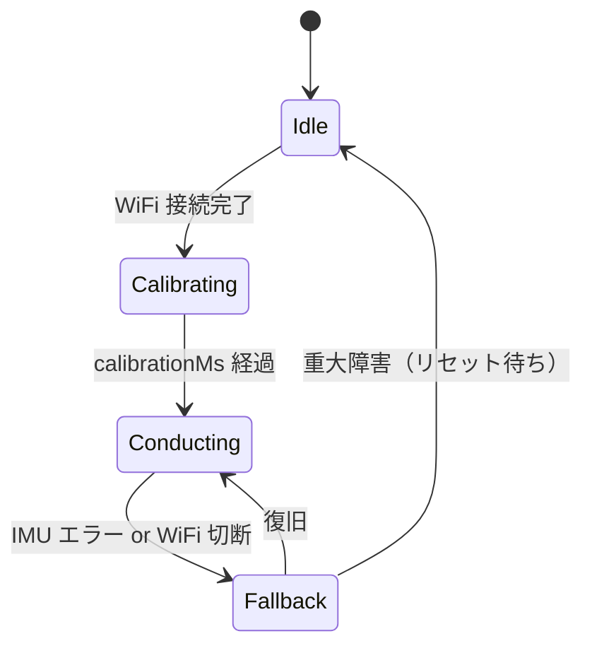

# 11. 指揮者ノード（node_01）詳細設計

EMA（Embedded-Module-Architecture）に準拠し、ハードウェアに触れる責務を `IModule`
派生クラスに、判断ロジックを `applyPattern()` 関数に分離する。

> **EMA 正本**: [`../../architecture_reference/ARCHITECTURE.md`](../../architecture_reference/ARCHITECTURE.md)
> 「モジュールの構造（.h/.cpp 分離）」「SystemData の集約」「ProjectConfig.h の役割」
> 「3 フェーズ実行モデル」を参照。

## 11.1 モジュール一覧と入出力分類

| モジュール | 分類 | 配列 | 責務 | 書込先 / 読出元 |
|---|---|---|---|---|
| `OrcNetModule`（共通層） | 入出力 | 両方 | WiFi 接続維持、UDP 受信ポーリング、UDP 送信キューフラッシュ | `data.orcNet` を読み書き |
| `ImuModule` | 入力専用 | `inputModules[]` | 内蔵 LSM6DSOX から 6 軸を読み出し | `data.imu` に書き込み |
| `OrcSenderModule` | 出力専用 | `outputModules[]` | `data.beat` / `data.tempo` を読んで CTRL/BEAT を `OrcNetModule.enqueueXxx()` に投入 | `data.beat`, `data.tempo` を読み出し |
| `StatusLedModule` | 出力専用 | `outputModules[]` | `data.conductor.state` 等を見て LED パターンを表示 | `data.conductor`, `data.orcNet` を読み出し |

**ロジック関数 `applyPattern(SystemData&)` で実装する処理**（EMA の流儀でモジュール化しない）:

| 処理 | 入力 | 出力 |
|---|---|---|
| 信号フィルタ（IIR LPF + ノルム計算） | `data.imu.acc` | `data.imu.accFiltered`, `data.imu.accNorm` |
| 拍検出（ピーク + 不応期） | `data.imu.accNorm` | `data.beat.event`, `data.beat.beatNo`, `data.beat.lastBeatMs` |
| テンポ推定（EMA） | `data.beat.lastBeatMs` の差分 | `data.tempo.bpm`, `data.tempo.nextBeatPredictedMs` |
| 強弱推定（ストレッチ） | `data.imu.accNorm` のピーク | `data.tempo.velocity` |
| 状態遷移（Idle / Calibrating / Conducting / Fallback） | `data.orcNet.wifiConnected`, `data.imu.isValid`, `data.calibration.*` | `data.conductor.state` |
| init 失敗モジュールの再試行 | `module.enabled == false` | （`module.init()` を呼んで `enabled = true` 復帰） |

## 11.2 `SystemData`（EMA 準拠の集約）

```cpp
// firmware/node_01/include/SystemData.h
#pragma once
#include "ImuModule.h"
#include "OrcNetModule.h"
#include "OrcSenderModule.h"
#include "StatusLedModule.h"

// applyPattern() の中間状態は専用ヘッダで定義
struct BeatLogicData {
    bool     event              = false;
    uint16_t beatNo             = 0;
    uint32_t lastBeatMs         = 0;
};

struct TempoLogicData {
    float    bpm                    = 0.0f;
    uint32_t nextBeatPredictedMs    = 0;
    uint8_t  velocity               = 64;   // 0〜127
};

struct CalibrationData {
    bool      done                  = false;
    uint32_t  startMs               = 0;
    float     gravityOffset[3]      = {0.0f, 0.0f, 0.0f};
};

enum class ConductorState : uint8_t {
    Idle        = 0,
    Calibrating = 1,
    Conducting  = 2,
    Fallback    = 3,
};

struct ConductorStateData {
    ConductorState state = ConductorState::Idle;
};

struct SystemData {
    ImuData             imu;
    OrcNetData          orcNet;
    OrcSenderData       sender;
    StatusLedData       led;
    BeatLogicData       beat;
    TempoLogicData      tempo;
    CalibrationData     calibration;
    ConductorStateData  conductor;
};
```

各 `{Module}Data` のフィールドは **デフォルト値必須**（EMA ルール）。
`{Module}Data` 構造体の定義は対応するモジュールの `.h` 内で行い、`SystemData.h` は
それらを include して集約するだけにする（[`../../architecture_reference/ARCHITECTURE.md`](../../architecture_reference/ARCHITECTURE.md)
「SystemData の集約」参照）。

## 11.3 `ProjectConfig`（EMA 準拠の集約）

```cpp
// firmware/node_01/include/ProjectConfig.h
#pragma once
#include "SystemData.h"

// 共有バスピン（特定モジュールに属さない）— 内蔵 IMU は I2C
constexpr int I2C_SDA_PIN = 18;       // UNO R4 WiFi の内蔵 IMU 接続ピン（実機で確認）
constexpr int I2C_SCL_PIN = 19;

// モジュール固有の設定は {MODULE}_CONFIG インスタンスとして集約
const ImuConfig IMU_CONFIG = {
    .address           = 0x6A,        // LSM6DSOX
    .sampleIntervalMs  = 5,           // 200 Hz
    .accelRangeG       = 4,
    .gyroRangeDps      = 2000,
};

const OrcNetConfig ORC_NET_CONFIG = {
    .ssid              = "OrchestraAP",     // 運用時差替え
    .pass              = "orchestra2026",   // 運用時差替え
    .listenPort        = 5001,
};

const OrcSenderConfig ORC_SENDER_CONFIG = {
    .ctrlIntervalMs    = 50,          // 20 Hz
    .beatRedundancy    = 1,           // 同一 BEAT を何発連送するか
};

const StatusLedConfig STATUS_LED_CONFIG = {
    .pin               = LED_BUILTIN,
    .blinkIntervalMs   = 500,
};

// applyPattern() 内のロジック用パラメータ（{Module}Config に属さない値はここに）
struct LogicParams {
    // 前処理
    float lpfAlpha                  = 0.1f;

    // 拍検出
    float beatAccelThresholdG       = 1.8f;
    uint32_t beatRefractoryMs       = 250;

    // テンポ推定
    float bpmEmaAlpha               = 0.3f;
    float bpmMin                    = 40.0f;
    float bpmMax                    = 240.0f;

    // キャリブレーション
    uint32_t calibrationMs          = 2000;

    // 再 init リトライ周期
    uint32_t reinitRetryMs          = 5000;
};
constexpr LogicParams LOGIC_PARAMS = {};
```

> **EMA ルール**: モジュール固有のピンは `constexpr` 単体定数にせず、Config インスタンス
> のリテラルに直書きする。共有バスピン（I2C_SDA/SCL 等）のみ `constexpr` 単体定数で良い。

## 11.4 IMU モジュール（`ImuModule`、入力専用）

Arduino UNO R4 WiFi 内蔵の `LSM6DSOX` を `Arduino_LSM6DSOX` ライブラリで読む。

```cpp
// firmware/node_01/lib/ImuModule/ImuModule.h
#pragma once
#include <Arduino.h>
#include <Wire.h>
#include "IModule.h"
#include "ModuleTimer.h"

struct ImuConfig {
    uint8_t   address;
    uint32_t  sampleIntervalMs;
    uint8_t   accelRangeG;
    uint16_t  gyroRangeDps;
};

struct ImuData {
    float    acc[3]          = {0.0f, 0.0f, 0.0f};
    float    gyro[3]         = {0.0f, 0.0f, 0.0f};
    float    accFiltered[3]  = {0.0f, 0.0f, 0.0f};   // applyPattern() が書く
    float    accNorm         = 0.0f;                  // applyPattern() が書く
    uint32_t lastSampleMs    = 0;
    bool     isValid         = false;
};

struct SystemData;  // 前方宣言のみ（SystemData.h は include しない）

class ImuModule : public IModule {
public:
    explicit ImuModule(const ImuConfig& config, TwoWire* wire);
    bool init() override;
    void updateInput(SystemData& data) override;
private:
    ImuConfig    _config;
    TwoWire*     _wire;
    ModuleTimer  _timer;
};
```

```cpp
// firmware/node_01/lib/ImuModule/ImuModule.cpp
#include "ImuModule.h"
#include "SystemData.h"   // ここで初めて include

ImuModule::ImuModule(const ImuConfig& cfg, TwoWire* wire)
    : _config(cfg), _wire(wire) {}

bool ImuModule::init() {
    // LSM6DSOX 初期化（_wire を使用）。失敗時 false
    // ...
    _timer.setTime();
    return true;
}

void ImuModule::updateInput(SystemData& data) {
    if (_timer.getNowTime() < _config.sampleIntervalMs) return;
    _timer.setTime();
    // I2C 読み取り → data.imu.acc / data.imu.gyro
    data.imu.lastSampleMs = millis();
    data.imu.isValid = true;
}
```

**サンプリング周波数の候補**:

| 候補 | 利点 | 欠点 | 採否 |
|---|---|---|---|
| 100 Hz | CPU 負荷が軽い | 速い振り下ろしのピークを見逃す可能性 | ✕ |
| 200 Hz | ライブラリ標準に近く、CPU 余裕あり | — | **◎ 推奨** |
| 500 Hz | 拍波形が滑らかに取れる | I2C 帯域とループ時間がきつくなる | △ |

初期値は **200 Hz**（`IMU_CONFIG.sampleIntervalMs = 5`）。

## 11.5 ロジック関数 `applyPattern()`（フィルタ + 拍検出 + テンポ + 状態遷移）

EMA の流儀に従い、判断ロジックは `IModule` 派生クラスではなく `applyPattern()` 関数に
記述する。

```cpp
// firmware/node_01/src/applyPattern.cpp
#include "SystemData.h"
#include "ProjectConfig.h"

static ModuleTimer s_reinitTimer;

void applyPattern(SystemData& data) {
    // (1) IIR LPF + ノルム計算
    if (data.imu.isValid) {
        const float a = LOGIC_PARAMS.lpfAlpha;
        for (int i = 0; i < 3; i++) {
            data.imu.accFiltered[i] = (1 - a) * data.imu.accFiltered[i] + a * data.imu.acc[i];
        }
        data.imu.accNorm = sqrtf(
            data.imu.accFiltered[0] * data.imu.accFiltered[0] +
            data.imu.accFiltered[1] * data.imu.accFiltered[1] +
            data.imu.accFiltered[2] * data.imu.accFiltered[2]);
    }

    // (2) 拍検出（state == Conducting のときのみ）
    data.beat.event = false;
    if (data.conductor.state == ConductorState::Conducting) {
        const uint32_t now = millis();
        if (data.imu.accNorm > LOGIC_PARAMS.beatAccelThresholdG &&
            (now - data.beat.lastBeatMs) >= LOGIC_PARAMS.beatRefractoryMs) {
            data.beat.event       = true;
            data.beat.beatNo     += 1;
            const uint32_t interval = now - data.beat.lastBeatMs;
            data.beat.lastBeatMs  = now;

            // (3) テンポ推定（EMA）
            if (interval > 0) {
                const float instBpm = 60000.0f / static_cast<float>(interval);
                const float a = LOGIC_PARAMS.bpmEmaAlpha;
                data.tempo.bpm = (1 - a) * data.tempo.bpm + a * instBpm;
                data.tempo.bpm = constrain(data.tempo.bpm,
                                            LOGIC_PARAMS.bpmMin,
                                            LOGIC_PARAMS.bpmMax);
                data.tempo.nextBeatPredictedMs =
                    now + static_cast<uint32_t>(60000.0f / data.tempo.bpm);
            }
        }
    }

    // (4) 状態遷移
    // Idle → Calibrating（WiFi 接続完了）
    // Calibrating → Conducting（calibrationMs 経過）
    // Conducting → Fallback（IMU エラー or WiFi 切断）
    // Fallback → Conducting（復旧）
    // ... 詳細は §11.7

    // (5) init 失敗モジュールの再試行
    // if (!imu.enabled && s_reinitTimer.getNowTime() > LOGIC_PARAMS.reinitRetryMs) { ... }
}
```

**拍検出アルゴリズム候補**:

| 候補 | 考え方 | 利点 | 欠点 |
|---|---|---|---|
| (a) ノルムピーク閾値 | `accNorm` が閾値を上向きに超えたら拍 | 装着方向に依存しない、実装容易 | 強い振りでないと検出しない |
| (b) 鉛直成分ゼロクロス | 重力方向の加速度が +→- に変わる点 | 人間の「振り下ろし」に直感的 | キャリブレーション（重力方向）が必要 |
| (c) 角速度ピーク | 手首回転のピーク | 指揮棒装着向き | 装着方向で出ない場合あり |

採用: **(a) ノルムピーク閾値**。第 13 章の V&V で検証後に (b) へ拡張する余地を残す。

## 11.6 コマンド送出（`OrcSenderModule`、出力専用）

`SystemData` を読んで `OrcNetModule` の送信キューに投入するだけ。実際の `Udp.send()` は
`OrcNetModule::updateOutput()` が一括で行う。

```cpp
// firmware/node_01/lib/OrcSenderModule/OrcSenderModule.h
#pragma once
#include <Arduino.h>
#include "IModule.h"
#include "ModuleTimer.h"
#include "OrcNetModule.h"

struct OrcSenderConfig {
    uint32_t ctrlIntervalMs;
    uint8_t  beatRedundancy;
};

struct OrcSenderData {
    uint32_t ctrlSeq = 0;
    uint32_t beatSeq = 0;
};

struct SystemData;

class OrcSenderModule : public IModule {
public:
    OrcSenderModule(const OrcSenderConfig& config, OrcNetModule* net);
    bool init() override;
    void updateOutput(SystemData& data) override;
private:
    OrcSenderConfig _config;
    OrcNetModule*   _net;
    ModuleTimer     _ctrlTimer;
};
```

```cpp
// firmware/node_01/lib/OrcSenderModule/OrcSenderModule.cpp（要点）
void OrcSenderModule::updateOutput(SystemData& data) {
    // BEAT: イベント駆動
    if (data.beat.event) {
        BeatPacket p;
        p.header.type = TYPE_BEAT;
        p.header.seq  = ++data.sender.beatSeq;
        p.beatNo      = data.beat.beatNo;
        for (int i = 0; i < _config.beatRedundancy; i++) {
            _net->enqueueBeat(p);
        }
    }

    // CTRL: 周期駆動
    if (_ctrlTimer.getNowTime() >= _config.ctrlIntervalMs) {
        _ctrlTimer.setTime();
        CtrlPacket p;
        p.header.type = TYPE_CTRL;
        p.header.seq  = ++data.sender.ctrlSeq;
        p.bpmQ8       = static_cast<uint16_t>(data.tempo.bpm * 8);
        p.velocity    = data.tempo.velocity;
        p.state       = static_cast<uint8_t>(data.conductor.state);
        _net->enqueueCtrl(p);
    }
}
```

## 11.7 状態遷移（`applyPattern()` の (4) で実装）



| 状態 | 意味 | モジュール / ロジック挙動 |
|---|---|---|
| Idle | 起動直後。WiFi 未接続 | `ImuModule.updateInput()` は動くが拍検出ロジックは無効、`OrcSenderModule` は何もしない、LED は低速点滅 |
| Calibrating | 初期静止姿勢の学習中（2 秒） | `applyPattern()` で重力オフセットを平均で記録、LED は中速点滅 |
| Conducting | 通常演奏中 | 全モジュール稼働、LED 点灯 |
| Fallback | 何らかのエラー | CTRL は送り続ける（state=Fallback）、BEAT は停止、LED は高速点滅 |

## 11.8 `StatusLedModule`（出力専用）

`data.conductor.state` / `data.orcNet.wifiConnected` / `data.imu.isValid` を見て
LED_BUILTIN の点滅パターンを変える。実装は `ModuleTimer` で周期切替。

## 11.9 実行フロー（`main.cpp`、EMA 3 フェーズループ）

```cpp
// firmware/node_01/src/main.cpp
#include <Arduino.h>
#include <Wire.h>
#include "IModule.h"
#include "SystemData.h"
#include "ProjectConfig.h"
#include "ImuModule.h"
#include "OrcNetModule.h"
#include "OrcSenderModule.h"
#include "StatusLedModule.h"

// 共有バスは main.cpp のグローバルスコープで生成（EMA「通信バスパターン」準拠）
static TwoWire imuWire = Wire;   // UNO R4 では既定の Wire を流用（実機構成に合わせ調整）

// SystemData 単一インスタンス
SystemData systemData;

// モジュールのインスタンス（コンストラクタは Config と必要なバスポインタのみ受け取る）
OrcNetModule       orcNet      (ORC_NET_CONFIG);
ImuModule          imu         (IMU_CONFIG, &imuWire);
OrcSenderModule    sender      (ORC_SENDER_CONFIG, &orcNet);
StatusLedModule    statusLed   (STATUS_LED_CONFIG);

// 入出力配列（OrcNet は入出力両方なので両配列に登録）
IModule* inputModules[] = {
    &orcNet,
    &imu,
};
constexpr int INPUT_COUNT = sizeof(inputModules) / sizeof(inputModules[0]);

IModule* outputModules[] = {
    &sender,
    &statusLed,
    &orcNet,         // 受信を入力フェーズで先に処理し、送信を出力フェーズの最後で
};
constexpr int OUTPUT_COUNT = sizeof(outputModules) / sizeof(outputModules[0]);

// applyPattern() は別 .cpp に分離
void applyPattern(SystemData& data);

static constexpr int MAX_RETRY = 3;

template <int N>
void initModules(IModule* (&modules)[N]) {
    for (int i = 0; i < N; i++) {
        bool ok = false;
        for (int r = 0; r < MAX_RETRY; r++) {
            if (modules[i]->init()) { ok = true; break; }
            delay(100);
        }
        if (!ok) modules[i]->enabled = false;
    }
}

void setup() {
    Serial.begin(115200);
    imuWire.begin();   // バス初期化は全モジュールの init() より前

    // 重複 init を避けるため、両配列に含まれるモジュールは 1 回だけ init() する
    // ここでは入力配列を初期化し、出力専用モジュールだけ追加で初期化する
    initModules(inputModules);
    sender.init();
    statusLed.init();
}

void loop() {
    // 1. 入力フェーズ
    for (int i = 0; i < INPUT_COUNT; i++) {
        if (inputModules[i]->enabled) inputModules[i]->updateInput(systemData);
    }

    // 2. ロジックフェーズ
    applyPattern(systemData);

    // 3. 出力フェーズ
    for (int i = 0; i < OUTPUT_COUNT; i++) {
        if (outputModules[i]->enabled) outputModules[i]->updateOutput(systemData);
    }
}
```

**EMA 準拠ポイント（再掲）**:

- モジュールのコンストラクタは `Config` とバスポインタのみ受け取り、`SystemData` /
  `ProjectConfig` への参照は持たない（API 経由で `SystemData&` を受け取るのは
  `updateInput()` / `updateOutput()` の引数のみ）
- バス初期化は `setup()` 内で全 `init()` より先に行う（`imuWire.begin()` を先頭に）
- ロジック（フィルタ・拍検出・テンポ推定・強弱・状態遷移）は `applyPattern()` に集約
- `OrcNetModule` は入出力両方を持つため両配列に登録、入力フェーズで受信、出力フェーズで送信
